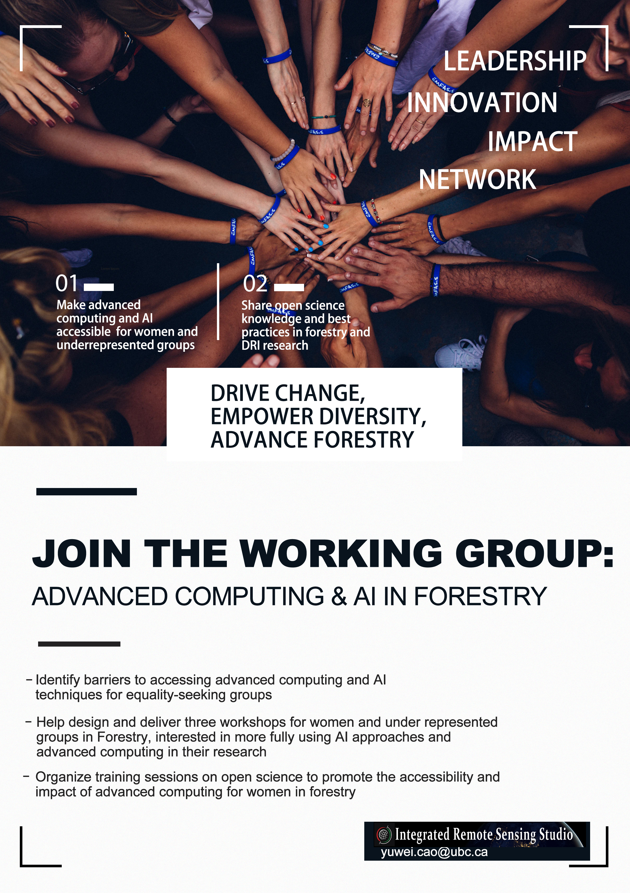

# DRI-EDIA-F4A

<!-- ALL-CONTRIBUTORS-BADGE:START - Do not remove or modify this section -->
[](#contributors-)
<!-- ALL-CONTRIBUTORS-BADGE:END -->

*DRI-EDIA Project: Advancing Equity in Forestry: Digital Research Infrastructure and Deep Learning for All*

## News
-  :boom: Nov., 2024: we are recruiting members of our working group at Forestry UBC. Contact: yuwei.cao@ubc.ca 
<p align="center">

</p>

## Vision and Mission

Develop accessible resources and training sessions that empower forestry professionals—especially women and other equity-seeking groups—with cutting-edge tools in Digital Research Infrastructure (DRI) and Deep Learning (DL). By facilitating broader utilization of these open-access tools among researchers and practitioners, we aim to foster women's innovation in the forestry community.

## Goals


## Outcomes:
1. Three workshops and peer-to-peer training sessions.
2. Deep learning models as case studies in workshops, and adhering to open science principles, we provide open access to our data, code, and pre-trained models. 
3. Github guideline documents / social media articles to democratize access to advanced computing and AI techniques for forestry professionals. 

## Repo Structure

Inspired by [Cookie Cutter Data Science](https://github.com/drivendata/cookiecutter-data-science).

```
├── LICENSE
├── README.md          <- The top-level README for users of this project.
│
├── reports            <- Generated analysis as HTML, PDF, LaTeX, etc.
│   └── figures        <- Generated graphics and figures to be used in reporting
│   └── notes          <- Generated notes/records to be used in reports/meetings/workshops
|   └── presentations  <- presentations used in workshops
│
│
├── src                <- Source code for use in this project.
│   │── data
│   |   ├── processed      <- The final, canonical data sets for modeling.
│   |   └── raw            <- The original, immutable data dump.
|   |
│   ├── dataset           <- Scripts to download or generate data
│   │   └── make_dataset.py
│   │
│   ├── models         <- Scripts to train models and then use trained models to make
│   │   │                 predictions
│   │   ├── predict_model.py
│   │   └── train_model.py
|   |   └── tune_model.py
|   |
│   │── checkpoints             <- Trained and serialized models, model predictions, or model summaries
│   |
│   └── visualization  <- Scripts to create exploratory and results-oriented visualizations
│       └── visualize.py
└──
```
---

## 🎯 Roadmap & Milestones


### Checklist for setting an online repository 

- [x] Add a README file
- [ ] Add a [CONTRIBUTING](CONTRIBUTING.md) file
- [x] Add a [LICENSE](LICENSE.md)
- [ ] Add a [Code of Conduct](CODE_OF_CONDUCT.md)
- [ ] Install [all-contributors](https://allcontributors.org/) bot
- [ ] .gitignore file (choose from a template)
- [ ] Issue templates
    - [ ] Optionally Install [Welcome/behavior](https://github.com/behaviorbot/welcome) bot (see The Turing Way [config](https://github.com/alan-turing-institute/the-turing-way/blob/main/.github/config.yml))
- [ ] Create a directory with files for project management (meetings, reports, proposals)
- [ ] Create a directory with files for communications
- [ ] Create a directory for research analysis
- [ ] Create a directory for research results/outcomes to share (?)
- [ ] Create a directory for ethics approval and project policies
- [ ] Create a directory with files for stakeholders' info and the nature of engagement
- [ ] Connect repo with Zenodo
- [ ] Add cff file for citation
- [ ] Add badges

## The Team ✨

- **Members:** Yuwei Cao & 
- **Roles & Responsibilities:** [Team Directory](link-to-directory) outlines roles, responsibilities and their ways of working.

## ♻️ License

This work is licensed under the MIT license (code) and Creative Commons Attribution 4.0 International license (for documentation). You are free to share and adapt the material for any purpose, even commercially, as long as you provide attribution (give appropriate credit, provide a link to the license, and indicate if changes were made) in any reasonable manner, but not in any way that suggests the licensor endorses you or your use and with no additional restrictions.

## 🤝 Citing & Acknowledgement

- **Citation Instructions:** How to cite the project.
- **Acknowledgment:** Recognising contributions by different members.

## 📫 Contact

- **Reach Out:** Contact details for questions, feedback, or ideas.

This repository has been created for anyone to reuse. This project follows the [all-contributors](https://github.com/all-contributors/all-contributors) specification. Contributions of any kind welcome!

