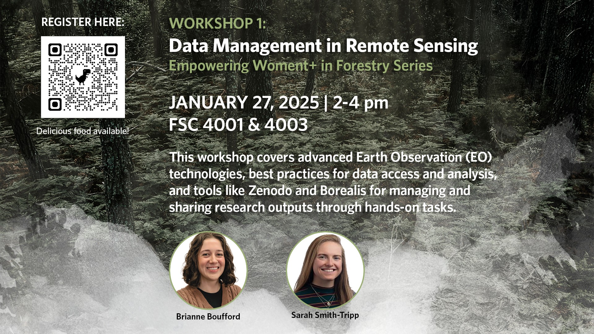
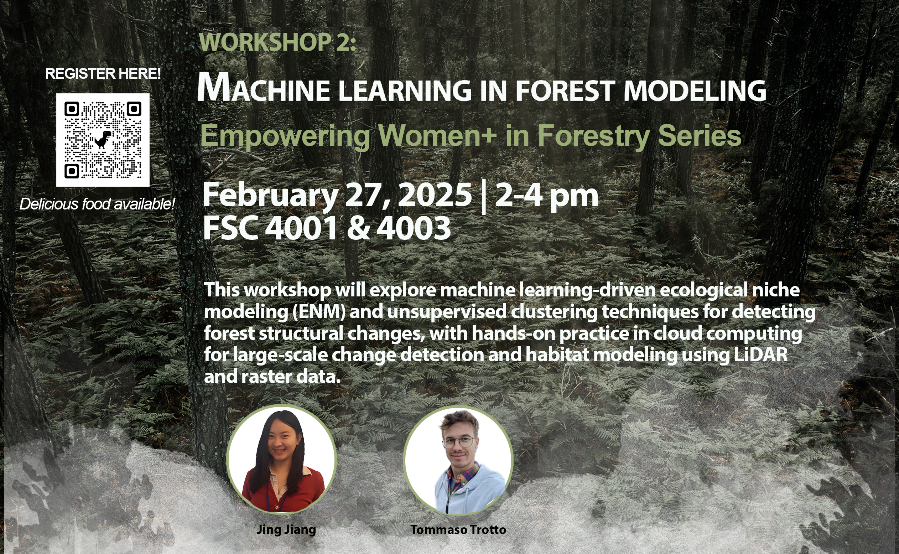

<h1 style="text-align:center;">
  DRI-EDIA-F4A: Advancing Equity in Forestry: Digital Research Infrastructure and Deep Learning for All
</h1>

<a href="https://github.com/yuwei-cao-git/DRI-EDIA-F4A">View on Github</a>

  <a href="#news">News</a> •
  <a href="#vision">About</a> •
  <a href="#team">Team</a> •
  <a href="#workshops">Workshops</a> •
  <a href="#tutorials">Tutorials</a>

 

## News
-  🔥 Mar. 31, 2025: we uploaded the [recording](https://www.youtube.com/watch?v=2cCBOIj36oA&t=459s), [slides](https://doi.org/10.5281/zenodo.15116336), and [code](https://yuwei-cao-git.github.io/DRI-EDIA-F4A/src/tree_species_classification/tree_species_classification.html) for our second workshop!

-  🎉 Mar. 04, 2025: we uploaded the [recording](https://youtu.be/ak4Y0czZn2w), [slides](./reports/workshops/workshop-2/README.md), [unsupervised learning code](https://yuwei-cao-git.github.io/DRI-EDIA-F4A/src/workshop2/python/html/unsupervised_learning.html), [run distributed code on cluster](https://yuwei-cao-git.github.io/DRI-EDIA-F4A/src/workshop2/python/html/distributed.html) for our second workshop!

-  🎉 Feb. 10, 2025: we uploaded the [recording](https://lnkd.in/dTnGpGDu) and [slides](https://doi.org/10.5281/zenodo.14624629) in our first workshop 🌟 Workshop 1: Earth Observation (EO) Data Management and Open Science Practices 🌟! 

 

## Tutorials

  <a href="https://doi.org/10.5281/zenodo.14624629" style="text-decoration: none;">
    <button style="background-color: #eee; color: #444; padding: 18px; border: none; border-radius: 1px; cursor: pointer; width: 100%; text-align: left; outline: none; font-size: 16px;">
      📄 Research Data Management
    </button>
  </a>
    

  <a href="https://yuwei-cao-git.github.io/DRI-EDIA-F4A/reports/workshops/workshop-1/UploadingZenodo.html" style="text-decoration: none;">
    <button style="background-color: #eee; color: #444; padding: 18px; border: none; border-radius: 1px; cursor: pointer; width: 100%; text-align: left; outline: none; font-size: 16px;">
      ⬆️ Uploading Data to Zenodo
    </button>
  </a>
    

  <a href="https://yuwei-cao-git.github.io/DRI-EDIA-F4A/src/workshop2/python/html/unsupervised_learning.html" style="text-decoration: none;">
    <button style="background-color: #eee; color: #444; padding: 18px; border: none; border-radius: 1px; cursor: pointer; width: 100%; text-align: left; outline: none; font-size: 16px;">
      🤖 Unsupervised Learning in Forest Modelling
    </button>
  </a>
    

  <a href="https://yuwei-cao-git.github.io/DRI-EDIA-F4A/src/workshop2/python/html/distributed.html" style="text-decoration: none;">
    <button style="background-color: #eee; color: #444; padding: 18px; border: none; border-radius: 1px; cursor: pointer; width: 100%; text-align: left; outline: none; font-size: 16px;">
      🔗 Distributed Computing
    </button>
  </a>
    

  <a href="https://yuwei-cao-git.github.io/DRI-EDIA-F4A/src/tree_species_classification/preprocess_data.html" style="text-decoration: none;">
    <button style="background-color: #eee; color: #444; padding: 18px; border: none; border-radius: 1px; cursor: pointer; width: 100%; text-align: left; outline: none; font-size: 16px;">
      🌎 Preprocess Data for Deep Learning
    </button>
  </a>
    
  <a href="https://yuwei-cao-git.github.io/DRI-EDIA-F4A/src/tree_species_classification/tree_species_classification.html" style="text-decoration: none;">
    <button style="background-color: #eee; color: #444; padding: 18px; border: none; border-radius: 1px; cursor: pointer; width: 100%; text-align: left; outline: none; font-size: 16px;">
      🌲 Deep Learning in Tree Species Classification
    </button>
  </a>

 

## Workshops
 

  
   
  
<strong>Workshop 1 - Earth Observation (EO) Data Management and Open Science Practices</strong>

 

  
   
  
<strong>Workshop 2 - Machine Learning in Forest Modelling</strong>

 

  
   
  
<strong>Workshop 3 - Advanced Computing and Deep Learning in Forestry</strong>

 

## Team

- **Members:** Yuwei Cao & [Brianne Boufford](https://github.com/brianneboufford) & [Harry Seely](https://github.com/harryseely) & [Jing Jiang](https://jingjiangmodels.github.io/) & [Sarah Smith-Tripp](https://sarahsmithtripp.github.io/) & [Tommaso Trotto](https://github.com/ttrotto) 
- **Roles & Responsibilities:** [Team Directory](./MeetTheTeam.md) outlines roles, responsibilities and their ways of working.

## Vision

Forestry professionals, environmental researchers, and policy makers are working together to advance digital research infrastructure and deep learning for all, and have gained significant skills to strengthen and disseminate their work in forestry research and applications through advanced computing and open science principles.

 

## 🎯 Roadmap & Milestones

[Roadmap & Milestones](../../issues/3)

## 🤝 Credits & Acknowledgement

- **Acknowledgment:** Thanks [Alejandro Coca-Castro](https://github.com/acocac) for mentoring this project and his valuable suggestions!

- These Contributing Guidelines have been adapted from the Contributing Guidelines of [STEMM Role Models App](https://github.com/KirstieJane/STEMMRoleModels/tree/gh-pages)! (License: MIT)

## Contributors ✨

Thanks goes to these wonderful people ([emoji key](https://allcontributors.org/docs/en/emoji-key)):
<!-- ALL-CONTRIBUTORS-LIST:START - Do not remove or modify this section -->
<!-- prettier-ignore-start -->
<!-- markdownlint-disable -->
<table>
  <tbody>
    <tr>
      <td align="center" valign="top" width="14.28%"><a href="https://github.com/gingerlolipop"> <b>gingerlolipop</b></a> <a href="#design-gingerlolipop" title="Design">🎨</a> <a href="https://github.com/yuwei-cao-git/DRI-EDIA-F4A/commits?author=gingerlolipop" title="Documentation">📖</a></td>
      <td align="center" valign="top" width="14.28%"><a href="https://github.com/ttrotto"> <b>Tommaso Trotto</b></a> <a href="#design-ttrotto" title="Design">🎨</a> <a href="https://github.com/yuwei-cao-git/DRI-EDIA-F4A/commits?author=ttrotto" title="Documentation">📖</a></td>
      <td align="center" valign="top" width="14.28%"><a href="https://harryseely.github.io"> <b>Harry Seely</b></a> <a href="#design-harryseely" title="Design">🎨</a> <a href="https://github.com/yuwei-cao-git/DRI-EDIA-F4A/commits?author=harryseely" title="Documentation">📖</a></td>
      <td align="center" valign="top" width="14.28%"><a href="https://github.com/brianneboufford"> <b>Brianne Boufford </b></a> <a href="#design-brianneboufford" title="Design">🎨</a> <a href="https://github.com/yuwei-cao-git/DRI-EDIA-F4A/commits?author=brianneboufford" title="Documentation">📖</a></td>
      <td align="center" valign="top" width="14.28%"><a href="https://sarahsmithtripp.github.io/"> <b>Sarah Smith-Tripp</b></a> <a href="#design-sarahsmithtripp" title="Design">🎨</a> <a href="https://github.com/yuwei-cao-git/DRI-EDIA-F4A/commits?author=sarahsmithtripp" title="Documentation">📖</a></td>
      <td align="center" valign="top" width="14.28%"><a href="https://github.com/yuwei-cao-git"> <b>Yuwei</b></a> <a href="#design-yuwei-cao-git" title="Design">🎨</a> <a href="https://github.com/yuwei-cao-git/DRI-EDIA-F4A/commits?author=yuwei-cao-git" title="Documentation">📖</a></td>
    </tr>
  </tbody>
</table>

<!-- markdownlint-restore -->
<!-- prettier-ignore-end -->

<!-- ALL-CONTRIBUTORS-LIST:END -->

This project follows the [all-contributors](https://github.com/all-contributors/all-contributors) specification. Contributions of any kind welcome!

## ♻️ License

This work is licensed under the MIT license. You are free to share and adapt the material for any purpose, even commercially, as long as you provide attribution (give appropriate credit, provide a link to the license, and indicate if changes were made) in any reasonable manner, but not in any way that suggests the licensor endorses you or your use and with no additional restrictions.
