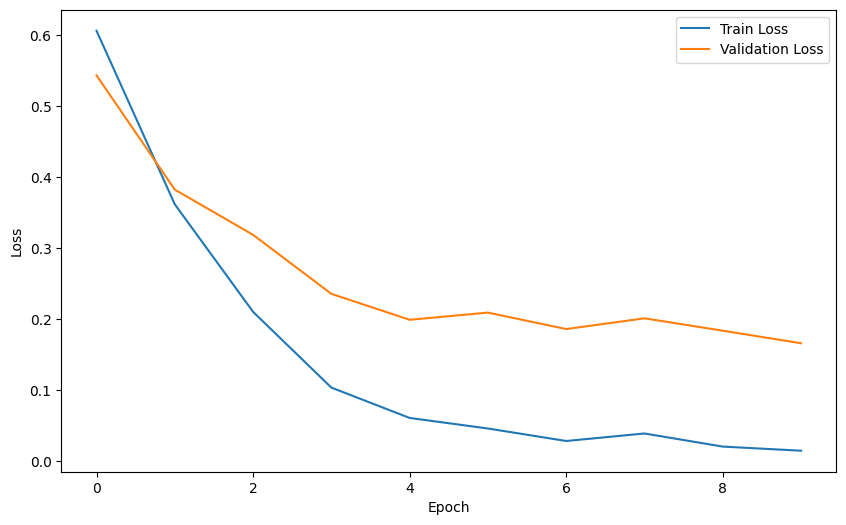
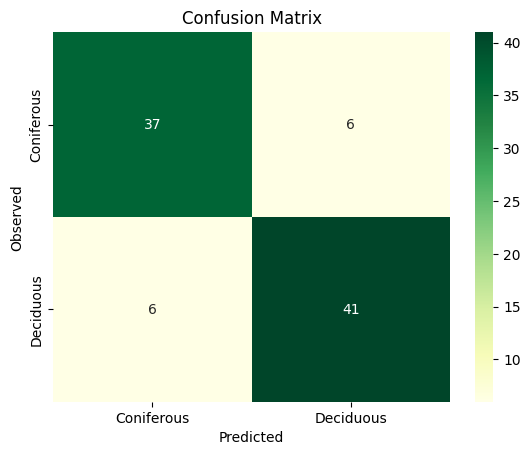
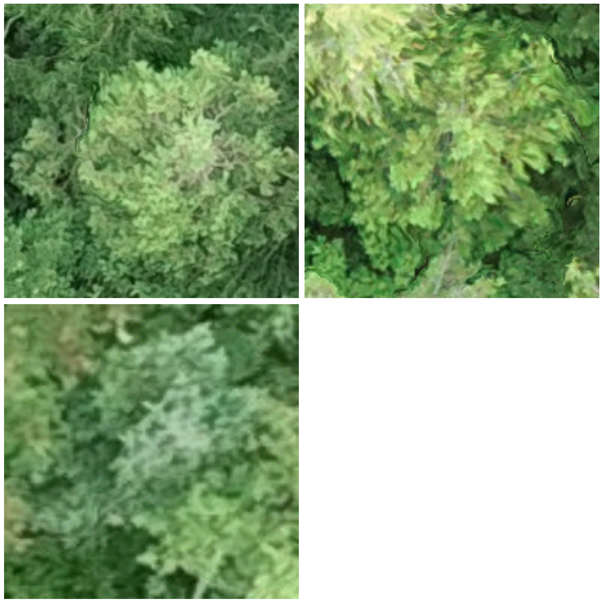
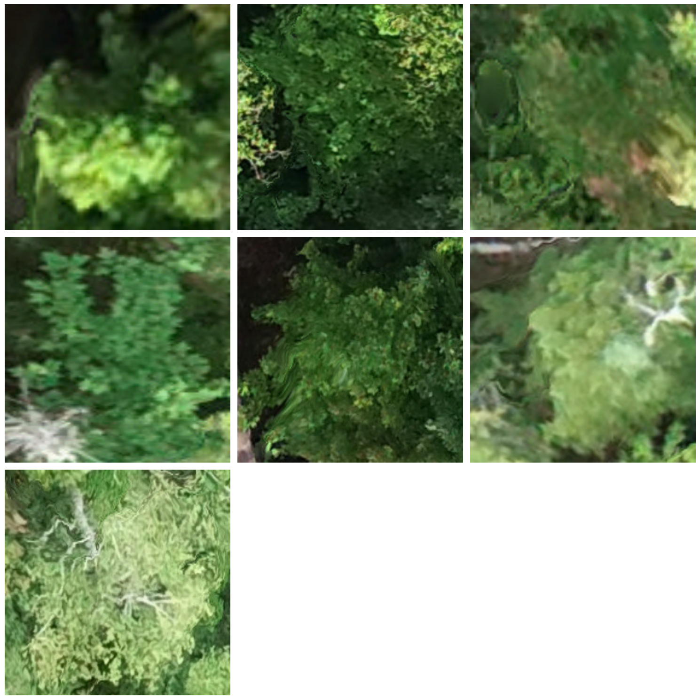

# Deep learning in Tree species classification Tutorial

[](https://colab.research.google.com/github/yuwei-cao-git/DRI-EDIA-F4A/blob/main/src/tree_species_classification/tree_species_classification.ipynb)

⚛ **Workflow**

1. Set up the Dataset
2. Create a model
3. Train
4. Test/Visualize result
5. Tune the network
6. Save/Depoly your model
7. Scale up your model

But first, let's pip/import the necessary libraries:


```python
%pip install pytorch_lightning lightning
```


```python
try:
  from google.colab import drive
  IN_COLAB=True
  # Mount the Google Drive at mount
  mount='/content/gdrive'
  print("Colab: mounting Google drive on ", mount)
  drive.mount(mount)
except:
  IN_COLAB=False

if IN_COLAB:
  print("We're running Colab")
```

    Colab: mounting Google drive on  /content/gdrive
    Mounted at /content/gdrive
    We're running Colab


```python
# Switch to the directory on the Google Drive that you want to use
import os
drive_root = mount + "/MyDrive/tree_species_classification"

# Change to the directory
print("\nColab: Changing directory to ", drive_root)
%cd $drive_root
```

    
    Colab: Changing directory to  /content/gdrive/MyDrive/tree_species_classification
    /content/gdrive/MyDrive/tree_species_classification


## Create a deep learning model


```python
import lightning as L
from PIL import Image
import torchvision.transforms as transforms
from torchvision.models import resnet50, ResNet50_Weights
from matplotlib import pyplot as plt
from lightning.pytorch.loggers import CSVLogger
from lightning.pytorch.loggers import TensorBoardLogger
import numpy as np
from torch.utils.data import Dataset, DataLoader
import torch
from torch.nn import functional as F
from torch import nn
import geopandas as gpd
from sklearn.model_selection import train_test_split
from PIL import Image
import pandas as pd
from pathlib import Path
from os.path import join
from sklearn.metrics import confusion_matrix
import seaborn as sns
import sklearn

```

### Load Crown Data


```python
#Load the crown polygons
crowns_df = gpd.read_file('data/tree_crowns_subset.gpkg')

# Map class labels to binary values
label_mapping = {'coniferous': 0, 'deciduous': 1}
crowns_df['label'] = crowns_df['species_type'].map(label_mapping)

#Set data dir
img_dir = 'data/clipped_crowns'
img_fpaths = list(Path(img_dir).glob("*.png"))

#Convert fpaths ls to data frame
img_df = pd.DataFrame(img_fpaths, columns=['fpath'])
img_df['crown_id'] = img_df['fpath'].apply(lambda x: int(x.stem.split(".")[0].split("_")[1]))

#Join with crowns_df
crowns_df = crowns_df.merge(img_df, on='crown_id', how='left')
crowns_df

```


  <div id="df-f49fe18f-c0e5-4069-a1b0-99689d456ab1" class="colab-df-container">
    <div>
<style scoped>
    .dataframe tbody tr th:only-of-type {
        vertical-align: middle;
    }

    .dataframe tbody tr th {
        vertical-align: top;
    }

    .dataframe thead th {
        text-align: right;
    }
</style>
<table border="1" class="dataframe">
  <thead>
    <tr style="text-align: right;">
      <th></th>
      <th>label</th>
      <th>common_name</th>
      <th>scientific_name</th>
      <th>genus</th>
      <th>crown_id</th>
      <th>species_type</th>
      <th>minx</th>
      <th>miny</th>
      <th>maxx</th>
      <th>maxy</th>
      <th>geometry</th>
      <th>fpath</th>
    </tr>
  </thead>
  <tbody>
    <tr>
      <th>0</th>
      <td>1</td>
      <td>Balsam fir</td>
      <td>Abies balsamea</td>
      <td>Pinaceae</td>
      <td>8340</td>
      <td>deciduous</td>
      <td>577189.0365</td>
      <td>5.093486e+06</td>
      <td>577192.0568</td>
      <td>5.093488e+06</td>
      <td>MULTIPOLYGON (((577191.446 5093488.217, 577191...</td>
      <td>data/clipped_crowns/crown_8340.png</td>
    </tr>
    <tr>
      <th>1</th>
      <td>1</td>
      <td>Balsam fir</td>
      <td>Abies balsamea</td>
      <td>Pinaceae</td>
      <td>9399</td>
      <td>deciduous</td>
      <td>576957.3289</td>
      <td>5.093309e+06</td>
      <td>576960.9351</td>
      <td>5.093313e+06</td>
      <td>MULTIPOLYGON (((576958.412 5093313.133, 576958...</td>
      <td>data/clipped_crowns/crown_9399.png</td>
    </tr>
    <tr>
      <th>2</th>
      <td>1</td>
      <td>Balsam fir</td>
      <td>Abies balsamea</td>
      <td>Pinaceae</td>
      <td>2458</td>
      <td>deciduous</td>
      <td>577064.1428</td>
      <td>5.093336e+06</td>
      <td>577066.9213</td>
      <td>5.093339e+06</td>
      <td>MULTIPOLYGON (((577066.056 5093338.765, 577065...</td>
      <td>data/clipped_crowns/crown_2458.png</td>
    </tr>
    <tr>
      <th>3</th>
      <td>1</td>
      <td>Balsam fir</td>
      <td>Abies balsamea</td>
      <td>Pinaceae</td>
      <td>2492</td>
      <td>deciduous</td>
      <td>577052.4109</td>
      <td>5.093352e+06</td>
      <td>577054.2873</td>
      <td>5.093355e+06</td>
      <td>MULTIPOLYGON (((577054.098 5093354.535, 577054...</td>
      <td>data/clipped_crowns/crown_2492.png</td>
    </tr>
    <tr>
      <th>4</th>
      <td>1</td>
      <td>Balsam fir</td>
      <td>Abies balsamea</td>
      <td>Pinaceae</td>
      <td>567</td>
      <td>deciduous</td>
      <td>577186.6727</td>
      <td>5.093215e+06</td>
      <td>577191.7753</td>
      <td>5.093218e+06</td>
      <td>MULTIPOLYGON (((577190.923 5093217.595, 577190...</td>
      <td>data/clipped_crowns/crown_567.png</td>
    </tr>
    <tr>
      <th>...</th>
      <td>...</td>
      <td>...</td>
      <td>...</td>
      <td>...</td>
      <td>...</td>
      <td>...</td>
      <td>...</td>
      <td>...</td>
      <td>...</td>
      <td>...</td>
      <td>...</td>
      <td>...</td>
    </tr>
    <tr>
      <th>595</th>
      <td>0</td>
      <td>Red maple</td>
      <td>Acer rubrum</td>
      <td>Sapindaceae</td>
      <td>54</td>
      <td>coniferous</td>
      <td>577088.2029</td>
      <td>5.093114e+06</td>
      <td>577093.3687</td>
      <td>5.093119e+06</td>
      <td>MULTIPOLYGON (((577090.925 5093119.305, 577090...</td>
      <td>data/clipped_crowns/crown_54.png</td>
    </tr>
    <tr>
      <th>596</th>
      <td>0</td>
      <td>Red maple</td>
      <td>Acer rubrum</td>
      <td>Sapindaceae</td>
      <td>1327</td>
      <td>coniferous</td>
      <td>577074.5608</td>
      <td>5.093307e+06</td>
      <td>577076.5100</td>
      <td>5.093309e+06</td>
      <td>MULTIPOLYGON (((577076.149 5093308.862, 577076...</td>
      <td>data/clipped_crowns/crown_1327.png</td>
    </tr>
    <tr>
      <th>597</th>
      <td>0</td>
      <td>Red maple</td>
      <td>Acer rubrum</td>
      <td>Sapindaceae</td>
      <td>6126</td>
      <td>coniferous</td>
      <td>577308.0109</td>
      <td>5.093633e+06</td>
      <td>577310.8445</td>
      <td>5.093635e+06</td>
      <td>MULTIPOLYGON (((577310.509 5093634.769, 577310...</td>
      <td>data/clipped_crowns/crown_6126.png</td>
    </tr>
    <tr>
      <th>598</th>
      <td>0</td>
      <td>Red maple</td>
      <td>Acer rubrum</td>
      <td>Sapindaceae</td>
      <td>5284</td>
      <td>coniferous</td>
      <td>577443.5990</td>
      <td>5.093582e+06</td>
      <td>577452.3151</td>
      <td>5.093589e+06</td>
      <td>MULTIPOLYGON (((577448.862 5093588.134, 577448...</td>
      <td>data/clipped_crowns/crown_5284.png</td>
    </tr>
    <tr>
      <th>599</th>
      <td>0</td>
      <td>Red maple</td>
      <td>Acer rubrum</td>
      <td>Sapindaceae</td>
      <td>6506</td>
      <td>coniferous</td>
      <td>577315.9984</td>
      <td>5.093473e+06</td>
      <td>577319.4037</td>
      <td>5.093477e+06</td>
      <td>MULTIPOLYGON (((577318.737 5093475.773, 577318...</td>
      <td>data/clipped_crowns/crown_6506.png</td>
    </tr>
  </tbody>
</table>
<p>600 rows × 12 columns</p>
</div>
    <div class="colab-df-buttons">

  <div class="colab-df-container">
    <button class="colab-df-convert" onclick="convertToInteractive('df-f49fe18f-c0e5-4069-a1b0-99689d456ab1')"
            title="Convert this dataframe to an interactive table."
            style="display:none;">

  <svg xmlns="http://www.w3.org/2000/svg" height="24px" viewBox="0 -960 960 960">
    <path d="M120-120v-720h720v720H120Zm60-500h600v-160H180v160Zm220 220h160v-160H400v160Zm0 220h160v-160H400v160ZM180-400h160v-160H180v160Zm440 0h160v-160H620v160ZM180-180h160v-160H180v160Zm440 0h160v-160H620v160Z"/>
  </svg>
    </button>

  <style>
    .colab-df-container {
      display:flex;
      gap: 12px;
    }

    .colab-df-convert {
      background-color: #E8F0FE;
      border: none;
      border-radius: 50%;
      cursor: pointer;
      display: none;
      fill: #1967D2;
      height: 32px;
      padding: 0 0 0 0;
      width: 32px;
    }

    .colab-df-convert:hover {
      background-color: #E2EBFA;
      box-shadow: 0px 1px 2px rgba(60, 64, 67, 0.3), 0px 1px 3px 1px rgba(60, 64, 67, 0.15);
      fill: #174EA6;
    }

    .colab-df-buttons div {
      margin-bottom: 4px;
    }

    [theme=dark] .colab-df-convert {
      background-color: #3B4455;
      fill: #D2E3FC;
    }

    [theme=dark] .colab-df-convert:hover {
      background-color: #434B5C;
      box-shadow: 0px 1px 3px 1px rgba(0, 0, 0, 0.15);
      filter: drop-shadow(0px 1px 2px rgba(0, 0, 0, 0.3));
      fill: #FFFFFF;
    }
  </style>

    <script>
      const buttonEl =
        document.querySelector('#df-f49fe18f-c0e5-4069-a1b0-99689d456ab1 button.colab-df-convert');
      buttonEl.style.display =
        google.colab.kernel.accessAllowed ? 'block' : 'none';

      async function convertToInteractive(key) {
        const element = document.querySelector('#df-f49fe18f-c0e5-4069-a1b0-99689d456ab1');
        const dataTable =
          await google.colab.kernel.invokeFunction('convertToInteractive',
                                                    [key], {});
        if (!dataTable) return;

        const docLinkHtml = 'Like what you see? Visit the ' +
          '<a target="_blank" href=https://colab.research.google.com/notebooks/data_table.ipynb>data table notebook</a>'
          + ' to learn more about interactive tables.';
        element.innerHTML = '';
        dataTable['output_type'] = 'display_data';
        await google.colab.output.renderOutput(dataTable, element);
        const docLink = document.createElement('div');
        docLink.innerHTML = docLinkHtml;
        element.appendChild(docLink);
      }
    </script>
  </div>


<div id="df-090fca2d-5cf3-4857-92e8-71ccc97554d5">
  <button class="colab-df-quickchart" onclick="quickchart('df-090fca2d-5cf3-4857-92e8-71ccc97554d5')"
            title="Suggest charts"
            style="display:none;">

<svg xmlns="http://www.w3.org/2000/svg" height="24px"viewBox="0 0 24 24"
     width="24px">
    <g>
        <path d="M19 3H5c-1.1 0-2 .9-2 2v14c0 1.1.9 2 2 2h14c1.1 0 2-.9 2-2V5c0-1.1-.9-2-2-2zM9 17H7v-7h2v7zm4 0h-2V7h2v10zm4 0h-2v-4h2v4z"/>
    </g>
</svg>
  </button>

<style>
  .colab-df-quickchart {
      --bg-color: #E8F0FE;
      --fill-color: #1967D2;
      --hover-bg-color: #E2EBFA;
      --hover-fill-color: #174EA6;
      --disabled-fill-color: #AAA;
      --disabled-bg-color: #DDD;
  }

  [theme=dark] .colab-df-quickchart {
      --bg-color: #3B4455;
      --fill-color: #D2E3FC;
      --hover-bg-color: #434B5C;
      --hover-fill-color: #FFFFFF;
      --disabled-bg-color: #3B4455;
      --disabled-fill-color: #666;
  }

  .colab-df-quickchart {
    background-color: var(--bg-color);
    border: none;
    border-radius: 50%;
    cursor: pointer;
    display: none;
    fill: var(--fill-color);
    height: 32px;
    padding: 0;
    width: 32px;
  }

  .colab-df-quickchart:hover {
    background-color: var(--hover-bg-color);
    box-shadow: 0 1px 2px rgba(60, 64, 67, 0.3), 0 1px 3px 1px rgba(60, 64, 67, 0.15);
    fill: var(--button-hover-fill-color);
  }

  .colab-df-quickchart-complete:disabled,
  .colab-df-quickchart-complete:disabled:hover {
    background-color: var(--disabled-bg-color);
    fill: var(--disabled-fill-color);
    box-shadow: none;
  }

  .colab-df-spinner {
    border: 2px solid var(--fill-color);
    border-color: transparent;
    border-bottom-color: var(--fill-color);
    animation:
      spin 1s steps(1) infinite;
  }

  @keyframes spin {
    0% {
      border-color: transparent;
      border-bottom-color: var(--fill-color);
      border-left-color: var(--fill-color);
    }
    20% {
      border-color: transparent;
      border-left-color: var(--fill-color);
      border-top-color: var(--fill-color);
    }
    30% {
      border-color: transparent;
      border-left-color: var(--fill-color);
      border-top-color: var(--fill-color);
      border-right-color: var(--fill-color);
    }
    40% {
      border-color: transparent;
      border-right-color: var(--fill-color);
      border-top-color: var(--fill-color);
    }
    60% {
      border-color: transparent;
      border-right-color: var(--fill-color);
    }
    80% {
      border-color: transparent;
      border-right-color: var(--fill-color);
      border-bottom-color: var(--fill-color);
    }
    90% {
      border-color: transparent;
      border-bottom-color: var(--fill-color);
    }
  }
</style>

  <script>
    async function quickchart(key) {
      const quickchartButtonEl =
        document.querySelector('#' + key + ' button');
      quickchartButtonEl.disabled = true;  // To prevent multiple clicks.
      quickchartButtonEl.classList.add('colab-df-spinner');
      try {
        const charts = await google.colab.kernel.invokeFunction(
            'suggestCharts', [key], {});
      } catch (error) {
        console.error('Error during call to suggestCharts:', error);
      }
      quickchartButtonEl.classList.remove('colab-df-spinner');
      quickchartButtonEl.classList.add('colab-df-quickchart-complete');
    }
    (() => {
      let quickchartButtonEl =
        document.querySelector('#df-090fca2d-5cf3-4857-92e8-71ccc97554d5 button');
      quickchartButtonEl.style.display =
        google.colab.kernel.accessAllowed ? 'block' : 'none';
    })();
  </script>
</div>

  <div id="id_74ef39ef-45cc-45f6-8b30-efa2f0f583b9">
    <style>
      .colab-df-generate {
        background-color: #E8F0FE;
        border: none;
        border-radius: 50%;
        cursor: pointer;
        display: none;
        fill: #1967D2;
        height: 32px;
        padding: 0 0 0 0;
        width: 32px;
      }

      .colab-df-generate:hover {
        background-color: #E2EBFA;
        box-shadow: 0px 1px 2px rgba(60, 64, 67, 0.3), 0px 1px 3px 1px rgba(60, 64, 67, 0.15);
        fill: #174EA6;
      }

      [theme=dark] .colab-df-generate {
        background-color: #3B4455;
        fill: #D2E3FC;
      }

      [theme=dark] .colab-df-generate:hover {
        background-color: #434B5C;
        box-shadow: 0px 1px 3px 1px rgba(0, 0, 0, 0.15);
        filter: drop-shadow(0px 1px 2px rgba(0, 0, 0, 0.3));
        fill: #FFFFFF;
      }
    </style>
    <button class="colab-df-generate" onclick="generateWithVariable('crowns_df')"
            title="Generate code using this dataframe."
            style="display:none;">

  <svg xmlns="http://www.w3.org/2000/svg" height="24px"viewBox="0 0 24 24"
       width="24px">
    <path d="M7,19H8.4L18.45,9,17,7.55,7,17.6ZM5,21V16.75L18.45,3.32a2,2,0,0,1,2.83,0l1.4,1.43a1.91,1.91,0,0,1,.58,1.4,1.91,1.91,0,0,1-.58,1.4L9.25,21ZM18.45,9,17,7.55Zm-12,3A5.31,5.31,0,0,0,4.9,8.1,5.31,5.31,0,0,0,1,6.5,5.31,5.31,0,0,0,4.9,4.9,5.31,5.31,0,0,0,6.5,1,5.31,5.31,0,0,0,8.1,4.9,5.31,5.31,0,0,0,12,6.5,5.46,5.46,0,0,0,6.5,12Z"/>
  </svg>
    </button>
    <script>
      (() => {
      const buttonEl =
        document.querySelector('#id_74ef39ef-45cc-45f6-8b30-efa2f0f583b9 button.colab-df-generate');
      buttonEl.style.display =
        google.colab.kernel.accessAllowed ? 'block' : 'none';

      buttonEl.onclick = () => {
        google.colab.notebook.generateWithVariable('crowns_df');
      }
      })();
    </script>
  </div>

    </div>
  </div>


```python
import seaborn as sns
import matplotlib.pyplot as plt

# Create the count plot with 'label'
ax = sns.countplot(data=crowns_df, x='label', hue='label', palette='viridis', legend=False)

# Add a custom legend
legend_labels = {0: 'Coniferous', 1: 'Deciduous'}
handles = [plt.Rectangle((0, 0), 1, 1, color=ax.patches[i].get_facecolor()) for i in range(len(legend_labels))]
plt.legend(handles, legend_labels.values(), title="Tree Type")

# Set labels and title
plt.xlabel('Label')
plt.ylabel('Count')
plt.title('Distribution of Labels')

plt.show()
```


    

    


#### Set up the Dataset


```python
class TreeCrownDataset(Dataset):
    def __init__(self, crowns_df, split, target_res=256, train_augmentations=[]):
        self.target_res = target_res
        self.split = split
        self.crowns_df = crowns_df
        self.train_augmentations = train_augmentations

        # Create a transform to resize and normalize the crown images
        self.transforms = [
            transforms.Resize((target_res, target_res)),
            transforms.ToTensor(),
        ]

        #Add additional transforms for data augmentation if using train dataset
        if self.split == 'train':
            self.transforms.extend(self.train_augmentations)

        # Build transform pipeline
        self.transforms = transforms.Compose(self.transforms)


    def __len__(self):
        return len(self.crowns_df)

    def __getitem__(self, idx):

        target_crown = self.crowns_df.iloc[idx]

        label = torch.tensor(target_crown['label']).long()

        crown_img = Image.open(target_crown['fpath']).convert('RGB')

        crown_tensor = self.transforms(crown_img)

        crown_id = target_crown['crown_id']

        return crown_tensor, label, crown_id
```

#### Set up the Lightning Data Module


```python
class TreeCrownDataModule(L.LightningDataModule):
    def __init__(self, crowns_df, batch_size=32, train_augmentations=[]):
        super().__init__()
        self.crowns_df = crowns_df
        self.batch_size = batch_size

    def setup(self, stage=None):

        #Split data into three dataframes for train/val/test
        train_val_df, self.test_df = train_test_split(self.crowns_df,
                                                      test_size=0.15,
                                                      random_state=42)

        self.train_df, self.val_df = train_test_split(train_val_df,
                                                      test_size=0.17,
                                                      random_state=42)

        #Report dataset sizes
        for name, df in [("Train", self.train_df),
                         ("Val", self.val_df),
                         ("Test", self.test_df)]:

            print(f"{name} dataset size: {len(df)}",
                  f"({round(len(df)/len(crowns_df)*100, 0)}%)")

        # Instantiate datasets
        self.train_dataset = TreeCrownDataset(self.train_df, split='train')

        self.val_dataset = TreeCrownDataset(self.val_df, split='val')

        self.test_dataset = TreeCrownDataset(self.test_df, split='test')

    def train_dataloader(self):
        return DataLoader(self.train_dataset,
                          batch_size=self.batch_size,
                          shuffle=True)

    def val_dataloader(self):
        return DataLoader(self.val_dataset,
                          batch_size=self.batch_size,
                          shuffle=False)

    def predict_dataloader(self):
        return DataLoader(self.test_dataset,
                          batch_size=self.batch_size,
                          shuffle=False
                          )

#Set the training data augmentations
train_augmentations = [
                transforms.RandomHorizontalFlip(),
                transforms.RandomRotation([-90, 90]),
                transforms.RandomResizedCrop(size=256, scale=(0.8, 1.0))
                ]

# Test the datamodule
crowns_datamodule = TreeCrownDataModule(crowns_df, train_augmentations=[])
crowns_datamodule.setup()

# Test loading a sample
sample = crowns_datamodule.train_dataset[0]
print(sample[0].shape)
print(sample[1])
```

    Train dataset size: 423 (70.0%)
    Val dataset size: 87 (14.0%)
    Test dataset size: 90 (15.0%)
    torch.Size([3, 256, 256])
    tensor(1)


### Set up the model


```python
class CNN(L.LightningModule):
    def __init__(self, lr, pretrained_weights=True):
        super(CNN, self).__init__()

        self.model = resnet50(weights=ResNet50_Weights.DEFAULT if pretrained_weights else None) # IMAGENET1K_V2 vs. random init

        # Modify the final fc layer of model to output a single value for binary classification
        self.model.fc = nn.Linear(self.model.fc.in_features, 1)

        #Add sigmoid activation to the end model
        self.model = nn.Sequential(self.model, nn.Sigmoid())

        self.criterion = nn.BCELoss()

        self.lr = lr

        self.save_hyperparameters()

    def forward(self, x):
        return self.model(x)

    def training_step(self, batch, batch_idx):
        x, y, _ = batch
        y_hat = self(x).squeeze()
        loss = self.criterion(y_hat, y.float())
        self.log('train_loss', loss, on_epoch=True, on_step=False)
        return loss

    def validation_step(self, batch, batch_idx):
        x, y, _ = batch
        y_hat = self(x).squeeze()
        loss = self.criterion(y_hat, y.float())
        self.log('val_loss', loss, on_epoch=True, on_step=False)
        return loss

    def predict_step(self, batch, batch_idx):
        x, y, id = batch
        y_hat = self(x).squeeze()

        return y_hat, y, id

    def configure_optimizers(self):
        optimizer = torch.optim.Adam(self.parameters(), lr=self.lr)
        return optimizer
```


```python
#Instantiate the model with 1 class (present/absent)
model = CNN(lr=0.0001)
print(model)

#Try passing some data through the model
batch, labels, ids = next(iter(crowns_datamodule.train_dataloader()))

# Pass batch through the model
y_hat = model(batch)

print("\nCrown IDs:\n", ids)

print("\nImage batch shape:\n", batch.shape)

print("\nOutput tensor shape:\n", y_hat.shape)

#View the predicted class probabilities
print("\nPredicted class probabilities:\n",
      y_hat.detach().cpu().numpy().squeeze())
```

    Downloading: "https://download.pytorch.org/models/resnet50-11ad3fa6.pth" to /root/.cache/torch/hub/checkpoints/resnet50-11ad3fa6.pth
    100%|██████████| 97.8M/97.8M [00:00<00:00, 168MB/s]


    CNN(
      (model): Sequential(
        (0): ResNet(
          (conv1): Conv2d(3, 64, kernel_size=(7, 7), stride=(2, 2), padding=(3, 3), bias=False)
          (bn1): BatchNorm2d(64, eps=1e-05, momentum=0.1, affine=True, track_running_stats=True)
          (relu): ReLU(inplace=True)
          (maxpool): MaxPool2d(kernel_size=3, stride=2, padding=1, dilation=1, ceil_mode=False)
          (layer1): Sequential(
            (0): Bottleneck(
              (conv1): Conv2d(64, 64, kernel_size=(1, 1), stride=(1, 1), bias=False)
              (bn1): BatchNorm2d(64, eps=1e-05, momentum=0.1, affine=True, track_running_stats=True)
              (conv2): Conv2d(64, 64, kernel_size=(3, 3), stride=(1, 1), padding=(1, 1), bias=False)
              (bn2): BatchNorm2d(64, eps=1e-05, momentum=0.1, affine=True, track_running_stats=True)
              (conv3): Conv2d(64, 256, kernel_size=(1, 1), stride=(1, 1), bias=False)
              (bn3): BatchNorm2d(256, eps=1e-05, momentum=0.1, affine=True, track_running_stats=True)
              (relu): ReLU(inplace=True)
              (downsample): Sequential(
                (0): Conv2d(64, 256, kernel_size=(1, 1), stride=(1, 1), bias=False)
                (1): BatchNorm2d(256, eps=1e-05, momentum=0.1, affine=True, track_running_stats=True)
              )
            )
            (1): Bottleneck(
              (conv1): Conv2d(256, 64, kernel_size=(1, 1), stride=(1, 1), bias=False)
              (bn1): BatchNorm2d(64, eps=1e-05, momentum=0.1, affine=True, track_running_stats=True)
              (conv2): Conv2d(64, 64, kernel_size=(3, 3), stride=(1, 1), padding=(1, 1), bias=False)
              (bn2): BatchNorm2d(64, eps=1e-05, momentum=0.1, affine=True, track_running_stats=True)
              (conv3): Conv2d(64, 256, kernel_size=(1, 1), stride=(1, 1), bias=False)
              (bn3): BatchNorm2d(256, eps=1e-05, momentum=0.1, affine=True, track_running_stats=True)
              (relu): ReLU(inplace=True)
            )
            (2): Bottleneck(
              (conv1): Conv2d(256, 64, kernel_size=(1, 1), stride=(1, 1), bias=False)
              (bn1): BatchNorm2d(64, eps=1e-05, momentum=0.1, affine=True, track_running_stats=True)
              (conv2): Conv2d(64, 64, kernel_size=(3, 3), stride=(1, 1), padding=(1, 1), bias=False)
              (bn2): BatchNorm2d(64, eps=1e-05, momentum=0.1, affine=True, track_running_stats=True)
              (conv3): Conv2d(64, 256, kernel_size=(1, 1), stride=(1, 1), bias=False)
              (bn3): BatchNorm2d(256, eps=1e-05, momentum=0.1, affine=True, track_running_stats=True)
              (relu): ReLU(inplace=True)
            )
          )
          (layer2): Sequential(
            (0): Bottleneck(
              (conv1): Conv2d(256, 128, kernel_size=(1, 1), stride=(1, 1), bias=False)
              (bn1): BatchNorm2d(128, eps=1e-05, momentum=0.1, affine=True, track_running_stats=True)
              (conv2): Conv2d(128, 128, kernel_size=(3, 3), stride=(2, 2), padding=(1, 1), bias=False)
              (bn2): BatchNorm2d(128, eps=1e-05, momentum=0.1, affine=True, track_running_stats=True)
              (conv3): Conv2d(128, 512, kernel_size=(1, 1), stride=(1, 1), bias=False)
              (bn3): BatchNorm2d(512, eps=1e-05, momentum=0.1, affine=True, track_running_stats=True)
              (relu): ReLU(inplace=True)
              (downsample): Sequential(
                (0): Conv2d(256, 512, kernel_size=(1, 1), stride=(2, 2), bias=False)
                (1): BatchNorm2d(512, eps=1e-05, momentum=0.1, affine=True, track_running_stats=True)
              )
            )
            (1): Bottleneck(
              (conv1): Conv2d(512, 128, kernel_size=(1, 1), stride=(1, 1), bias=False)
              (bn1): BatchNorm2d(128, eps=1e-05, momentum=0.1, affine=True, track_running_stats=True)
              (conv2): Conv2d(128, 128, kernel_size=(3, 3), stride=(1, 1), padding=(1, 1), bias=False)
              (bn2): BatchNorm2d(128, eps=1e-05, momentum=0.1, affine=True, track_running_stats=True)
              (conv3): Conv2d(128, 512, kernel_size=(1, 1), stride=(1, 1), bias=False)
              (bn3): BatchNorm2d(512, eps=1e-05, momentum=0.1, affine=True, track_running_stats=True)
              (relu): ReLU(inplace=True)
            )
            (2): Bottleneck(
              (conv1): Conv2d(512, 128, kernel_size=(1, 1), stride=(1, 1), bias=False)
              (bn1): BatchNorm2d(128, eps=1e-05, momentum=0.1, affine=True, track_running_stats=True)
              (conv2): Conv2d(128, 128, kernel_size=(3, 3), stride=(1, 1), padding=(1, 1), bias=False)
              (bn2): BatchNorm2d(128, eps=1e-05, momentum=0.1, affine=True, track_running_stats=True)
              (conv3): Conv2d(128, 512, kernel_size=(1, 1), stride=(1, 1), bias=False)
              (bn3): BatchNorm2d(512, eps=1e-05, momentum=0.1, affine=True, track_running_stats=True)
              (relu): ReLU(inplace=True)
            )
            (3): Bottleneck(
              (conv1): Conv2d(512, 128, kernel_size=(1, 1), stride=(1, 1), bias=False)
              (bn1): BatchNorm2d(128, eps=1e-05, momentum=0.1, affine=True, track_running_stats=True)
              (conv2): Conv2d(128, 128, kernel_size=(3, 3), stride=(1, 1), padding=(1, 1), bias=False)
              (bn2): BatchNorm2d(128, eps=1e-05, momentum=0.1, affine=True, track_running_stats=True)
              (conv3): Conv2d(128, 512, kernel_size=(1, 1), stride=(1, 1), bias=False)
              (bn3): BatchNorm2d(512, eps=1e-05, momentum=0.1, affine=True, track_running_stats=True)
              (relu): ReLU(inplace=True)
            )
          )
          (layer3): Sequential(
            (0): Bottleneck(
              (conv1): Conv2d(512, 256, kernel_size=(1, 1), stride=(1, 1), bias=False)
              (bn1): BatchNorm2d(256, eps=1e-05, momentum=0.1, affine=True, track_running_stats=True)
              (conv2): Conv2d(256, 256, kernel_size=(3, 3), stride=(2, 2), padding=(1, 1), bias=False)
              (bn2): BatchNorm2d(256, eps=1e-05, momentum=0.1, affine=True, track_running_stats=True)
              (conv3): Conv2d(256, 1024, kernel_size=(1, 1), stride=(1, 1), bias=False)
              (bn3): BatchNorm2d(1024, eps=1e-05, momentum=0.1, affine=True, track_running_stats=True)
              (relu): ReLU(inplace=True)
              (downsample): Sequential(
                (0): Conv2d(512, 1024, kernel_size=(1, 1), stride=(2, 2), bias=False)
                (1): BatchNorm2d(1024, eps=1e-05, momentum=0.1, affine=True, track_running_stats=True)
              )
            )
            (1): Bottleneck(
              (conv1): Conv2d(1024, 256, kernel_size=(1, 1), stride=(1, 1), bias=False)
              (bn1): BatchNorm2d(256, eps=1e-05, momentum=0.1, affine=True, track_running_stats=True)
              (conv2): Conv2d(256, 256, kernel_size=(3, 3), stride=(1, 1), padding=(1, 1), bias=False)
              (bn2): BatchNorm2d(256, eps=1e-05, momentum=0.1, affine=True, track_running_stats=True)
              (conv3): Conv2d(256, 1024, kernel_size=(1, 1), stride=(1, 1), bias=False)
              (bn3): BatchNorm2d(1024, eps=1e-05, momentum=0.1, affine=True, track_running_stats=True)
              (relu): ReLU(inplace=True)
            )
            (2): Bottleneck(
              (conv1): Conv2d(1024, 256, kernel_size=(1, 1), stride=(1, 1), bias=False)
              (bn1): BatchNorm2d(256, eps=1e-05, momentum=0.1, affine=True, track_running_stats=True)
              (conv2): Conv2d(256, 256, kernel_size=(3, 3), stride=(1, 1), padding=(1, 1), bias=False)
              (bn2): BatchNorm2d(256, eps=1e-05, momentum=0.1, affine=True, track_running_stats=True)
              (conv3): Conv2d(256, 1024, kernel_size=(1, 1), stride=(1, 1), bias=False)
              (bn3): BatchNorm2d(1024, eps=1e-05, momentum=0.1, affine=True, track_running_stats=True)
              (relu): ReLU(inplace=True)
            )
            (3): Bottleneck(
              (conv1): Conv2d(1024, 256, kernel_size=(1, 1), stride=(1, 1), bias=False)
              (bn1): BatchNorm2d(256, eps=1e-05, momentum=0.1, affine=True, track_running_stats=True)
              (conv2): Conv2d(256, 256, kernel_size=(3, 3), stride=(1, 1), padding=(1, 1), bias=False)
              (bn2): BatchNorm2d(256, eps=1e-05, momentum=0.1, affine=True, track_running_stats=True)
              (conv3): Conv2d(256, 1024, kernel_size=(1, 1), stride=(1, 1), bias=False)
              (bn3): BatchNorm2d(1024, eps=1e-05, momentum=0.1, affine=True, track_running_stats=True)
              (relu): ReLU(inplace=True)
            )
            (4): Bottleneck(
              (conv1): Conv2d(1024, 256, kernel_size=(1, 1), stride=(1, 1), bias=False)
              (bn1): BatchNorm2d(256, eps=1e-05, momentum=0.1, affine=True, track_running_stats=True)
              (conv2): Conv2d(256, 256, kernel_size=(3, 3), stride=(1, 1), padding=(1, 1), bias=False)
              (bn2): BatchNorm2d(256, eps=1e-05, momentum=0.1, affine=True, track_running_stats=True)
              (conv3): Conv2d(256, 1024, kernel_size=(1, 1), stride=(1, 1), bias=False)
              (bn3): BatchNorm2d(1024, eps=1e-05, momentum=0.1, affine=True, track_running_stats=True)
              (relu): ReLU(inplace=True)
            )
            (5): Bottleneck(
              (conv1): Conv2d(1024, 256, kernel_size=(1, 1), stride=(1, 1), bias=False)
              (bn1): BatchNorm2d(256, eps=1e-05, momentum=0.1, affine=True, track_running_stats=True)
              (conv2): Conv2d(256, 256, kernel_size=(3, 3), stride=(1, 1), padding=(1, 1), bias=False)
              (bn2): BatchNorm2d(256, eps=1e-05, momentum=0.1, affine=True, track_running_stats=True)
              (conv3): Conv2d(256, 1024, kernel_size=(1, 1), stride=(1, 1), bias=False)
              (bn3): BatchNorm2d(1024, eps=1e-05, momentum=0.1, affine=True, track_running_stats=True)
              (relu): ReLU(inplace=True)
            )
          )
          (layer4): Sequential(
            (0): Bottleneck(
              (conv1): Conv2d(1024, 512, kernel_size=(1, 1), stride=(1, 1), bias=False)
              (bn1): BatchNorm2d(512, eps=1e-05, momentum=0.1, affine=True, track_running_stats=True)
              (conv2): Conv2d(512, 512, kernel_size=(3, 3), stride=(2, 2), padding=(1, 1), bias=False)
              (bn2): BatchNorm2d(512, eps=1e-05, momentum=0.1, affine=True, track_running_stats=True)
              (conv3): Conv2d(512, 2048, kernel_size=(1, 1), stride=(1, 1), bias=False)
              (bn3): BatchNorm2d(2048, eps=1e-05, momentum=0.1, affine=True, track_running_stats=True)
              (relu): ReLU(inplace=True)
              (downsample): Sequential(
                (0): Conv2d(1024, 2048, kernel_size=(1, 1), stride=(2, 2), bias=False)
                (1): BatchNorm2d(2048, eps=1e-05, momentum=0.1, affine=True, track_running_stats=True)
              )
            )
            (1): Bottleneck(
              (conv1): Conv2d(2048, 512, kernel_size=(1, 1), stride=(1, 1), bias=False)
              (bn1): BatchNorm2d(512, eps=1e-05, momentum=0.1, affine=True, track_running_stats=True)
              (conv2): Conv2d(512, 512, kernel_size=(3, 3), stride=(1, 1), padding=(1, 1), bias=False)
              (bn2): BatchNorm2d(512, eps=1e-05, momentum=0.1, affine=True, track_running_stats=True)
              (conv3): Conv2d(512, 2048, kernel_size=(1, 1), stride=(1, 1), bias=False)
              (bn3): BatchNorm2d(2048, eps=1e-05, momentum=0.1, affine=True, track_running_stats=True)
              (relu): ReLU(inplace=True)
            )
            (2): Bottleneck(
              (conv1): Conv2d(2048, 512, kernel_size=(1, 1), stride=(1, 1), bias=False)
              (bn1): BatchNorm2d(512, eps=1e-05, momentum=0.1, affine=True, track_running_stats=True)
              (conv2): Conv2d(512, 512, kernel_size=(3, 3), stride=(1, 1), padding=(1, 1), bias=False)
              (bn2): BatchNorm2d(512, eps=1e-05, momentum=0.1, affine=True, track_running_stats=True)
              (conv3): Conv2d(512, 2048, kernel_size=(1, 1), stride=(1, 1), bias=False)
              (bn3): BatchNorm2d(2048, eps=1e-05, momentum=0.1, affine=True, track_running_stats=True)
              (relu): ReLU(inplace=True)
            )
          )
          (avgpool): AdaptiveAvgPool2d(output_size=(1, 1))
          (fc): Linear(in_features=2048, out_features=1, bias=True)
        )
        (1): Sigmoid()
      )
      (criterion): BCELoss()
    )
    
    Crown IDs:
     tensor([2648, 1446,  579, 9226, 5744, 6641, 6426, 6865, 3832, 2560, 5034, 4461,
             233, 4119, 7429, 6221, 4200, 1362, 9236, 5770, 2350, 1438, 3407, 5438,
            6318,  891, 3223, 2488, 7067, 9233, 6737, 1494])
    
    Image batch shape:
     torch.Size([32, 3, 256, 256])
    
    Output tensor shape:
     torch.Size([32, 1])
    
    Predicted class probabilities:
     [0.49712744 0.4790547  0.5167126  0.45847675 0.47571528 0.50378984
     0.4806627  0.47133324 0.46858212 0.4780063  0.4591862  0.49085122
     0.5068038  0.49928945 0.48584807 0.505633   0.50510865 0.48676297
     0.5686578  0.48190606 0.49865714 0.4582818  0.47904262 0.53434956
     0.44840366 0.50194734 0.48886827 0.4564724  0.5279636  0.5000776
     0.5013218  0.51534027]


### Set up the trainer


```python
# put together
crowns_datamodule = TreeCrownDataModule(crowns_df, train_augmentations=[])
crowns_datamodule.setup()
model = CNN(lr=0.0001)
csv_logger = CSVLogger('', name='logs', version=0)
tensorboard_logger = TensorBoardLogger('', name='lightning_logs', version=0)
trainer = L.Trainer(max_epochs=10, logger=[csv_logger, tensorboard_logger], devices=1)
trainer.fit(model, datamodule=crowns_datamodule)
```

    Train dataset size: 423 (70.0%)
    Val dataset size: 87 (14.0%)
    Test dataset size: 90 (15.0%)


    INFO: GPU available: True (cuda), used: True
    INFO:lightning.pytorch.utilities.rank_zero:GPU available: True (cuda), used: True
    INFO: TPU available: False, using: 0 TPU cores
    INFO:lightning.pytorch.utilities.rank_zero:TPU available: False, using: 0 TPU cores
    INFO: HPU available: False, using: 0 HPUs
    INFO:lightning.pytorch.utilities.rank_zero:HPU available: False, using: 0 HPUs
    /usr/local/lib/python3.11/dist-packages/lightning/fabric/loggers/csv_logs.py:268: Experiment logs directory logs/version_0 exists and is not empty. Previous log files in this directory will be deleted when the new ones are saved!


    Train dataset size: 423 (70.0%)
    Val dataset size: 87 (14.0%)
    Test dataset size: 90 (15.0%)


    /usr/local/lib/python3.11/dist-packages/lightning/pytorch/callbacks/model_checkpoint.py:654: Checkpoint directory logs/version_0/checkpoints exists and is not empty.
    INFO: LOCAL_RANK: 0 - CUDA_VISIBLE_DEVICES: [0]
    INFO:lightning.pytorch.accelerators.cuda:LOCAL_RANK: 0 - CUDA_VISIBLE_DEVICES: [0]
    INFO: 
      | Name      | Type       | Params | Mode 
    -------------------------------------------------
    0 | model     | Sequential | 23.5 M | train
    1 | criterion | BCELoss    | 0      | train
    -------------------------------------------------
    23.5 M    Trainable params
    0         Non-trainable params
    23.5 M    Total params
    94.040    Total estimated model params size (MB)
    154       Modules in train mode
    0         Modules in eval mode
    INFO:lightning.pytorch.callbacks.model_summary:
      | Name      | Type       | Params | Mode 
    -------------------------------------------------
    0 | model     | Sequential | 23.5 M | train
    1 | criterion | BCELoss    | 0      | train
    -------------------------------------------------
    23.5 M    Trainable params
    0         Non-trainable params
    23.5 M    Total params
    94.040    Total estimated model params size (MB)
    154       Modules in train mode
    0         Modules in eval mode


    Sanity Checking: |          | 0/? [00:00<?, ?it/s]


    /usr/local/lib/python3.11/dist-packages/lightning/pytorch/loops/fit_loop.py:310: The number of training batches (14) is smaller than the logging interval Trainer(log_every_n_steps=50). Set a lower value for log_every_n_steps if you want to see logs for the training epoch.


    Training: |          | 0/? [00:00<?, ?it/s]


    Validation: |          | 0/? [00:00<?, ?it/s]


    Validation: |          | 0/? [00:00<?, ?it/s]


    Validation: |          | 0/? [00:00<?, ?it/s]


    Validation: |          | 0/? [00:00<?, ?it/s]


    Validation: |          | 0/? [00:00<?, ?it/s]


    Validation: |          | 0/? [00:00<?, ?it/s]


    Validation: |          | 0/? [00:00<?, ?it/s]


    Validation: |          | 0/? [00:00<?, ?it/s]


    Validation: |          | 0/? [00:00<?, ?it/s]


    Validation: |          | 0/? [00:00<?, ?it/s]


    INFO: `Trainer.fit` stopped: `max_epochs=10` reached.
    INFO:lightning.pytorch.utilities.rank_zero:`Trainer.fit` stopped: `max_epochs=10` reached.


### Visualize training process


```python
# Read the logs CSV file after training
logs_df = pd.read_csv(csv_logger.log_dir + '/metrics.csv')
logs_df = logs_df.groupby('epoch').mean()  # merge the train and valid rows
logs_df['epoch'] = logs_df.index  # because "Epoch" gets turned into the index
logs_df.index.name = ''  # to remove the name "Epoch" from the index

# Display the logs
print(logs_df)
```

        step  train_loss  val_loss  epoch
                                         
    0   13.0    0.606503  0.543630      0
    1   27.0    0.362105  0.382762      1
    2   41.0    0.210748  0.319108      2
    3   55.0    0.104064  0.236043      3
    4   69.0    0.061297  0.199528      4
    5   83.0    0.046444  0.209622      5
    6   97.0    0.028861  0.186452      6
    7  111.0    0.039431  0.201574      7
    8  125.0    0.020977  0.184163      8
    9  139.0    0.015162  0.166470      9


```python
#Plot learning curve
plt.figure(figsize=(10, 6))
plt.plot(logs_df['train_loss'], label='Train Loss')
plt.plot(logs_df['val_loss'], label='Validation Loss')
plt.xlabel('Epoch')
plt.ylabel('Loss')
plt.legend()
plt.show()
```


    

    


Or you can use tensorboard


```python
%reload_ext tensorboard
%tensorboard --logdir=lightning_logs/
```


    <IPython.core.display.Javascript object>


```python
def calc_test_oa():
    #Test the model on the test set
    out = trainer.predict(model, datamodule=crowns_datamodule, return_predictions=True)

    # Separate predictions and targets from output
    pred_class_probs = np.concatenate([batch[0] for batch in out])
    obs = np.concatenate([batch[1] for batch in out])
    ids = np.concatenate([batch[2] for batch in out])

    #Convert to obs-pred dataframe
    test_df = pd.DataFrame({'obs': obs, 'pred_class_probs': pred_class_probs, 'crown_id': ids})

    #Convert class probabilities to binary predictions
    test_df['pred_boolean_class'] = (test_df['pred_class_probs'] > 0.5)

    #Convert binary predictions to integers
    test_df['pred'] = test_df['pred_boolean_class'].astype(int)

    #Add a column for correct/incorrect predictions
    test_df['correct'] = test_df['obs'] == test_df['pred']

    #Join with crowns_df
    test_df = test_df.merge(crowns_df, on='crown_id', how='left')

    #Calculate overall accuracy using sklearn
    overall_acc = sklearn.metrics.accuracy_score(y_true=test_df['obs'], y_pred=test_df['pred'])


    #Check how many crowns were classified correctly
    n_correct = len(test_df[test_df['correct'] == True])

    print(f"Summary: {n_correct} / {len(test_df)} crowns were classified correctly.")
    return overall_acc, test_df
```


```python
overall_acc, test_df = calc_test_oa()
print(f"Overall accuracy: {overall_acc:.2f}")
```

    INFO: LOCAL_RANK: 0 - CUDA_VISIBLE_DEVICES: [0]
    INFO:lightning.pytorch.accelerators.cuda:LOCAL_RANK: 0 - CUDA_VISIBLE_DEVICES: [0]


    Train dataset size: 423 (70.0%)
    Val dataset size: 87 (14.0%)
    Test dataset size: 90 (15.0%)


    Predicting: |          | 0/? [00:00<?, ?it/s]


    Summary: 78 / 90 crowns were classified correctly.
    Overall accuracy: 0.87


```python
print(label_mapping)

#Generate a confusion matrix using seaborn
cm = confusion_matrix(y_true=test_df['obs'],
                      y_pred=test_df['pred'])

#Plot the confusion matrix
classes = ['Coniferous', 'Deciduous']
sns.heatmap(cm, annot=True,
            cmap='YlGn',
            xticklabels=classes,
            yticklabels=classes)


plt.xlabel('Predicted')
plt.ylabel('Observed')
plt.title('Confusion Matrix')
plt.show()


```

    {'coniferous': 0, 'deciduous': 1}


    

    


```python
# Let's view the incorrectly classified crowns
incorrect_df = test_df[test_df['correct'] == False]

#Plot incorrecty classified coniferous/deciduous crowns

for c_type in test_df['species_type'].unique():

    print(f"\nIncorrectly classified {c_type} crowns.\n")

    # Filter the incorrect crowns by species type
    incorrect_type_df = test_df[(test_df['correct'] == False) & (test_df['species_type'] == c_type)]

    # Number of images
    num_images = len(incorrect_type_df)

    # Determine the grid size
    grid_size = int(num_images**0.5) + 1

    # Create a figure and axes
    fig, axes = plt.subplots(grid_size, grid_size, figsize=(15, 15))

    # Flatten the axes array for easy iteration
    axes = axes.flatten()

    # Read the incorrect crown files and plot them
    for ax, fpath in zip(axes, incorrect_type_df['fpath']):
        img = Image.open(fpath)
        ax.imshow(img)
        ax.axis('off')

    # Hide any remaining empty subplots
    for ax in axes[num_images:]:
        ax.axis('off')

    plt.tight_layout()

    plt.show()
```

    
    Incorrectly classified deciduous crowns.
    


    

    


    
    Incorrectly classified coniferous crowns.
    


    

    


### Tune hyperparameters

Forget about ML for a second. Imagine you are baking a cookie. You have 3 things you can change about the cookie:

- Sugar type (white, brown, cane)
- Baking time (15 minutes, 30 minutes)
- Cooking temperature (360, 400 degrees)

There are 12 possible variations of cookies you can make. One of them will be the most delicious.

To find out which cookie tastes the best, you need to make all variations and assign a score
- 🤢
- 🤔
- 😆
- 😍

This is called a hyperparameter sweep. Your three hyperparameters are sugar, baking time, cooking temperature.

```
python make_cookie.py --sugar 'white' --baking_time 15 --temperature 400
python make_cookie.py --sugar 'brown' --baking_time 15 --temperature 400

```

🏄🏽‍♀️ **what combination of parameters produces the best performing model?**

The definition of "best" depends on the work you are doing. In general, "best" refers to the lowest loss. At Lightning, we tend to think of "best" as the lowest loss for the least amount of time spent training.

If we run this training script with different hyperparameter combinations, it produces different loss curves

##### test 1: pretrained weigths


```python
# put together
crowns_datamodule = TreeCrownDataModule(crowns_df, train_augmentations=[])
crowns_datamodule.setup()
csv_logger = CSVLogger('', name='logs', version=1)
tensorboard_logger = TensorBoardLogger('', name='lightning_logs', version=1)
model = CNN(lr=0.01, pretrained_weights=False)
trainer = L.Trainer(max_epochs=10, logger=[csv_logger, tensorboard_logger], devices=1)
trainer.fit(model, datamodule=crowns_datamodule)
```

    Train dataset size: 423 (70.0%)
    Val dataset size: 87 (14.0%)
    Test dataset size: 90 (15.0%)


    INFO: GPU available: True (cuda), used: True
    INFO:lightning.pytorch.utilities.rank_zero:GPU available: True (cuda), used: True
    INFO: TPU available: False, using: 0 TPU cores
    INFO:lightning.pytorch.utilities.rank_zero:TPU available: False, using: 0 TPU cores
    INFO: HPU available: False, using: 0 HPUs
    INFO:lightning.pytorch.utilities.rank_zero:HPU available: False, using: 0 HPUs
    /usr/local/lib/python3.11/dist-packages/lightning/fabric/loggers/csv_logs.py:268: Experiment logs directory logs/version_0 exists and is not empty. Previous log files in this directory will be deleted when the new ones are saved!
    /usr/local/lib/python3.11/dist-packages/lightning/pytorch/callbacks/model_checkpoint.py:654: Checkpoint directory logs/version_0/checkpoints exists and is not empty.
    INFO: LOCAL_RANK: 0 - CUDA_VISIBLE_DEVICES: [0]
    INFO:lightning.pytorch.accelerators.cuda:LOCAL_RANK: 0 - CUDA_VISIBLE_DEVICES: [0]
    INFO: 
      | Name      | Type       | Params | Mode 
    -------------------------------------------------
    0 | model     | Sequential | 23.5 M | train
    1 | criterion | BCELoss    | 0      | train
    -------------------------------------------------
    23.5 M    Trainable params
    0         Non-trainable params
    23.5 M    Total params
    94.040    Total estimated model params size (MB)
    154       Modules in train mode
    0         Modules in eval mode
    INFO:lightning.pytorch.callbacks.model_summary:
      | Name      | Type       | Params | Mode 
    -------------------------------------------------
    0 | model     | Sequential | 23.5 M | train
    1 | criterion | BCELoss    | 0      | train
    -------------------------------------------------
    23.5 M    Trainable params
    0         Non-trainable params
    23.5 M    Total params
    94.040    Total estimated model params size (MB)
    154       Modules in train mode
    0         Modules in eval mode


    Train dataset size: 423 (70.0%)
    Val dataset size: 87 (14.0%)
    Test dataset size: 90 (15.0%)


    Sanity Checking: |          | 0/? [00:00<?, ?it/s]


    /usr/local/lib/python3.11/dist-packages/lightning/pytorch/loops/fit_loop.py:310: The number of training batches (14) is smaller than the logging interval Trainer(log_every_n_steps=50). Set a lower value for log_every_n_steps if you want to see logs for the training epoch.


    Training: |          | 0/? [00:00<?, ?it/s]


    Validation: |          | 0/? [00:00<?, ?it/s]


    Validation: |          | 0/? [00:00<?, ?it/s]


    Validation: |          | 0/? [00:00<?, ?it/s]


    Validation: |          | 0/? [00:00<?, ?it/s]


    Validation: |          | 0/? [00:00<?, ?it/s]


    Validation: |          | 0/? [00:00<?, ?it/s]


    Validation: |          | 0/? [00:00<?, ?it/s]


    Validation: |          | 0/? [00:00<?, ?it/s]


    Validation: |          | 0/? [00:00<?, ?it/s]


    Validation: |          | 0/? [00:00<?, ?it/s]


    INFO: `Trainer.fit` stopped: `max_epochs=10` reached.
    INFO:lightning.pytorch.utilities.rank_zero:`Trainer.fit` stopped: `max_epochs=10` reached.


```python
overall_acc, test_df = calc_test_oa()
print(f"Overall accuracy: {overall_acc:.2f}")
```

    INFO: LOCAL_RANK: 0 - CUDA_VISIBLE_DEVICES: [0]
    INFO:lightning.pytorch.accelerators.cuda:LOCAL_RANK: 0 - CUDA_VISIBLE_DEVICES: [0]


    Train dataset size: 423 (70.0%)
    Val dataset size: 87 (14.0%)
    Test dataset size: 90 (15.0%)


    Predicting: |          | 0/? [00:00<?, ?it/s]


    Summary: 65 / 90 crowns were classified correctly.
    Overall accuracy: 0.72


##### test 2: different learning rate


```python
# put together
model = CNN(lr=0.01)
csv_logger = CSVLogger('', name='logs', version=2)
tensorboard_logger = TensorBoardLogger('', name='lightning_logs', version=2)
trainer = L.Trainer(max_epochs=10, logger=[csv_logger, tensorboard_logger], devices=1)
trainer.fit(model, datamodule=crowns_datamodule)
```

    INFO: GPU available: True (cuda), used: True
    INFO:lightning.pytorch.utilities.rank_zero:GPU available: True (cuda), used: True
    INFO: TPU available: False, using: 0 TPU cores
    INFO:lightning.pytorch.utilities.rank_zero:TPU available: False, using: 0 TPU cores
    INFO: HPU available: False, using: 0 HPUs
    INFO:lightning.pytorch.utilities.rank_zero:HPU available: False, using: 0 HPUs
    /usr/local/lib/python3.11/dist-packages/lightning/fabric/loggers/csv_logs.py:268: Experiment logs directory logs/version_0 exists and is not empty. Previous log files in this directory will be deleted when the new ones are saved!
    /usr/local/lib/python3.11/dist-packages/lightning/pytorch/callbacks/model_checkpoint.py:654: Checkpoint directory logs/version_0/checkpoints exists and is not empty.
    INFO: LOCAL_RANK: 0 - CUDA_VISIBLE_DEVICES: [0]
    INFO:lightning.pytorch.accelerators.cuda:LOCAL_RANK: 0 - CUDA_VISIBLE_DEVICES: [0]
    INFO: 
      | Name      | Type       | Params | Mode 
    -------------------------------------------------
    0 | model     | Sequential | 23.5 M | train
    1 | criterion | BCELoss    | 0      | train
    -------------------------------------------------
    23.5 M    Trainable params
    0         Non-trainable params
    23.5 M    Total params
    94.040    Total estimated model params size (MB)
    154       Modules in train mode
    0         Modules in eval mode
    INFO:lightning.pytorch.callbacks.model_summary:
      | Name      | Type       | Params | Mode 
    -------------------------------------------------
    0 | model     | Sequential | 23.5 M | train
    1 | criterion | BCELoss    | 0      | train
    -------------------------------------------------
    23.5 M    Trainable params
    0         Non-trainable params
    23.5 M    Total params
    94.040    Total estimated model params size (MB)
    154       Modules in train mode
    0         Modules in eval mode


    Train dataset size: 423 (70.0%)
    Val dataset size: 87 (14.0%)
    Test dataset size: 90 (15.0%)


    Sanity Checking: |          | 0/? [00:00<?, ?it/s]


    /usr/local/lib/python3.11/dist-packages/lightning/pytorch/loops/fit_loop.py:310: The number of training batches (14) is smaller than the logging interval Trainer(log_every_n_steps=50). Set a lower value for log_every_n_steps if you want to see logs for the training epoch.


    Training: |          | 0/? [00:00<?, ?it/s]


    Validation: |          | 0/? [00:00<?, ?it/s]


    Validation: |          | 0/? [00:00<?, ?it/s]


    Validation: |          | 0/? [00:00<?, ?it/s]


    Validation: |          | 0/? [00:00<?, ?it/s]


    Validation: |          | 0/? [00:00<?, ?it/s]


    Validation: |          | 0/? [00:00<?, ?it/s]


    Validation: |          | 0/? [00:00<?, ?it/s]


    Validation: |          | 0/? [00:00<?, ?it/s]


    Validation: |          | 0/? [00:00<?, ?it/s]


    Validation: |          | 0/? [00:00<?, ?it/s]


    INFO: `Trainer.fit` stopped: `max_epochs=10` reached.
    INFO:lightning.pytorch.utilities.rank_zero:`Trainer.fit` stopped: `max_epochs=10` reached.


```python
overall_acc, test_df = calc_test_oa()
print(f"Overall accuracy: {overall_acc:.2f}")
```

    INFO: LOCAL_RANK: 0 - CUDA_VISIBLE_DEVICES: [0]
    INFO:lightning.pytorch.accelerators.cuda:LOCAL_RANK: 0 - CUDA_VISIBLE_DEVICES: [0]


    Train dataset size: 423 (70.0%)
    Val dataset size: 87 (14.0%)
    Test dataset size: 90 (15.0%)


    Predicting: |          | 0/? [00:00<?, ?it/s]


    Summary: 73 / 90 crowns were classified correctly.
    Overall accuracy: 0.81


```python
%reload_ext tensorboard
%tensorboard --logdir=lightning_logs/
```


    <IPython.core.display.Javascript object>


### Save/Depoly your model


```python
trainer.save_checkpoint(filepath=".ckpt/model.ckpt")
```


```python
model = CNN.load_from_checkpoint(".ckpt/model.ckpt", lr=0.01)
model.freeze()

crowns_datamodule = TreeCrownDataModule(crowns_df, train_augmentations=[])
crowns_datamodule.setup()
test_predictions = trainer.predict(model, datamodule=crowns_datamodule)
```

    INFO: LOCAL_RANK: 0 - CUDA_VISIBLE_DEVICES: [0]
    INFO:lightning.pytorch.accelerators.cuda:LOCAL_RANK: 0 - CUDA_VISIBLE_DEVICES: [0]


    Train dataset size: 423 (70.0%)
    Val dataset size: 87 (14.0%)
    Test dataset size: 90 (15.0%)
    Train dataset size: 423 (70.0%)
    Val dataset size: 87 (14.0%)
    Test dataset size: 90 (15.0%)


    Predicting: |          | 0/? [00:00<?, ?it/s]


```python
overall_acc, test_df = calc_test_oa()
print(f"Overall accuracy: {overall_acc:.2f}")
```

    INFO: LOCAL_RANK: 0 - CUDA_VISIBLE_DEVICES: [0]
    INFO:lightning.pytorch.accelerators.cuda:LOCAL_RANK: 0 - CUDA_VISIBLE_DEVICES: [0]


    Train dataset size: 423 (70.0%)
    Val dataset size: 87 (14.0%)
    Test dataset size: 90 (15.0%)


    Predicting: |          | 0/? [00:00<?, ?it/s]


    Summary: 73 / 90 crowns were classified correctly.
    Overall accuracy: 0.81


TorchScript allows you to serialize your models in a way that it can be loaded in non-Python environments. The LightningModule has a handy method to_torchscript() that returns a scripted module which you can save or directly use.


```python
script = model.to_torchscript()

# save for use in production environment
torch.jit.save(script, ".ckpt/model.pt")

# use it
#Try passing some data through the model
batch, labels, ids = next(iter(crowns_datamodule.test_dataloader()))

scripted_module = torch.jit.load(".ckpt/model.pt")
output = scripted_module(batch)
```

### Scale up your model/dataset

You can either make all cookies sequentially (which will take you 4.5 hours). Or you can get 12 kitchens and cook them all in parallel, and you'll know in 30 minutes.

If a kitchen is a GPU, then you need 12 GPUs to run each experiment to see which cookie is the best. The power of Lightning is the ability to run sweeps like this on 12 different GPUs (or 1,000 GPUs if you'd like) to get you the best version of a model fast.

Train on GPUs
The Trainer will run on all available GPUs by default. Make sure you’re running on a machine with at least one GPU. There’s no need to specify any NVIDIA flags as Lightning will do it for you.


```python
from lightning import Trainer

# run on as many GPUs as available by default
trainer = Trainer(accelerator="auto", devices="auto", strategy="auto")
# equivalent to
trainer = Trainer()

# run on one GPU
trainer = Trainer(accelerator="gpu", devices=1)
# run on multiple GPUs
trainer = Trainer(accelerator="gpu", devices=8)
# choose the number of devices automatically
trainer = Trainer(accelerator="gpu", devices="auto")
```

Train on Slurm Cluster


```python
# train.py
def main(args):
    model = CNN(args)

    trainer = Trainer(accelerator="gpu", devices=8, num_nodes=4, strategy="ddp")

    trainer.fit(model)


if __name__ == "__main__":
    args = ...  # you can use your CLI parser of choice, or the `LightningCLI` or using config.yaml
    # TRAIN
    main(args)
```


```python
%%writefile submit.sh
# (submit.sh)
#!/bin/bash -l

# SLURM SUBMIT SCRIPT
#SBATCH --nodes=4             # This needs to match Trainer(num_nodes=...)
#SBATCH --gres=gpu:8
#SBATCH --ntasks-per-node=8   # This needs to match Trainer(devices=...)
#SBATCH --mem=0
#SBATCH --time=0-02:00:00

# activate conda env
source activate $1

# debugging flags (optional)
export NCCL_DEBUG=INFO
export PYTHONFAULTHANDLER=1

# on your cluster you might need these:
# set the network interface
# export NCCL_SOCKET_IFNAME=^docker0,lo

# might need the latest CUDA
# module load NCCL/2.4.7-1-cuda.10.0

# run script from above
srun python3 train.py
```


```python
%%!
sbatch submit.sh
```

Or you can even parallel the baking procedure...


### wandba sweep


```python
import wandb

wandb.login()
```

    wandb: Using wandb-core as the SDK backend.  Please refer to https://wandb.me/wandb-core for more information.
    wandb: Logging into wandb.ai. (Learn how to deploy a W&B server locally: https://wandb.me/wandb-server)
    wandb: You can find your API key in your browser here: https://wandb.ai/authorize
    wandb: Paste an API key from your profile and hit enter:wandb: WARNING If you're specifying your api key in code, ensure this code is not shared publicly.
    wandb: WARNING Consider setting the WANDB_API_KEY environment variable, or running `wandb login` from the command line.
    wandb: No netrc file found, creating one.
    wandb: Appending key for api.wandb.ai to your netrc file: C:\Users\ycao68\_netrc
    wandb: Currently logged in as: yuwei-cao-wandb (ubc-yuwei-cao) to https://api.wandb.ai. Use `wandb login --relogin` to force relogin


    True


```python
%%html
<iframe src="https://api.wandb.ai/links/ubc-yuwei-cao/ebnspmv1" style="border:none;height:1024px;width:100%">
```


<iframe src="https://api.wandb.ai/links/ubc-yuwei-cao/ebnspmv1" style="border:none;height:1024px;width:100%">


