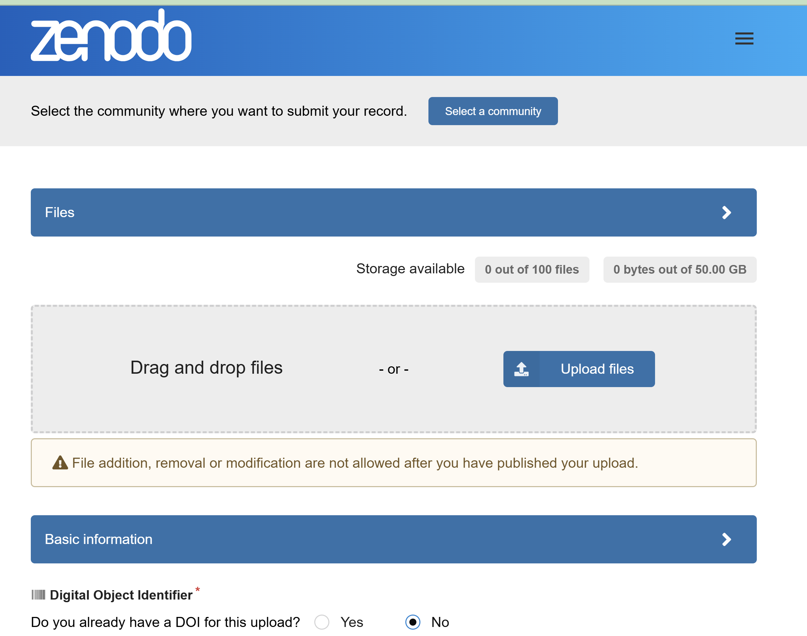
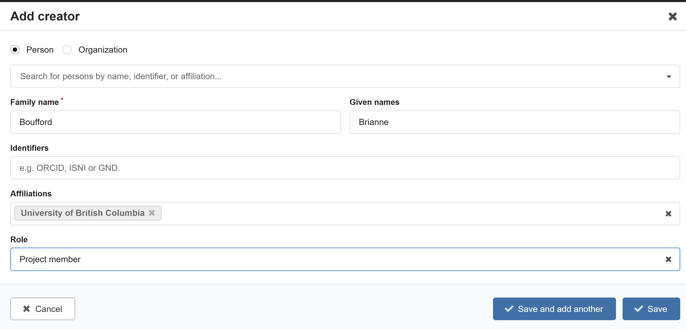
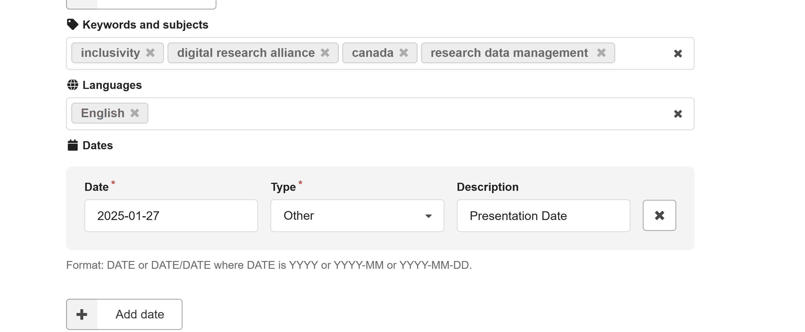
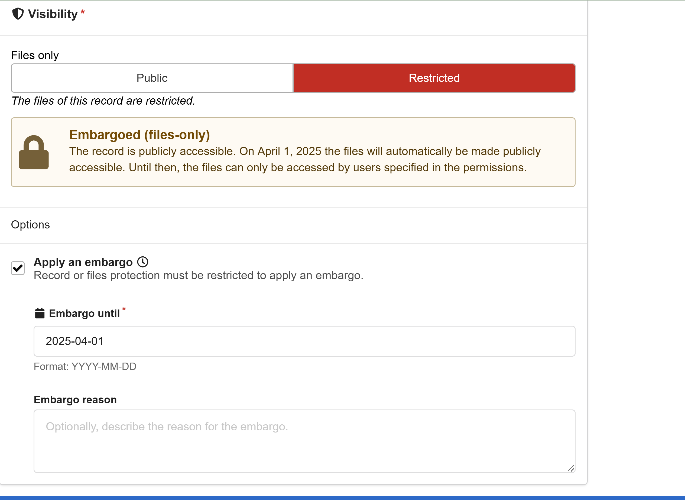
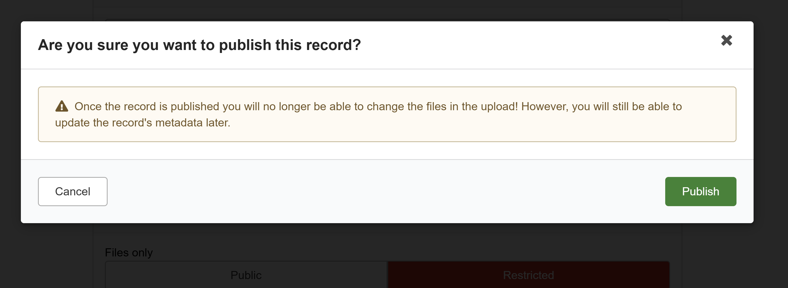

## here we start the upload

## we can add the people working on the project 

## we can include information about the project 

## we can embargo until we want to share with the world 

## we want to wait to publish until we are SURE we are done with our files - this is a repository! 
