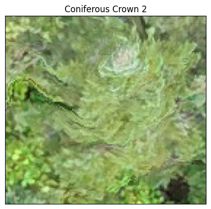

# Workshop 3 Tutorial: Data Preprocessing

<table class="tfo-notebook-buttons" align="left" width=90%>
  <td width=30% align="left">     <a target="_blank" href="https://colab.research.google.com/github/yuwei-cao-git/DRI-EDIA-F4A/blob/main/src/tree_species_classification/preprocess_data.ipynb">Run in Google Colab </a> </td>
  <td width=30% align="left">     <a target="_blank" href="https://github.com/yuwei-cao-git/DRI-EDIA-F4A/blob/main/src/tree_species_classification/preprocess_data.ipynb">View on Github</a> </td>
  <td width=30% align="left">     <a href="https://drive.google.com/uc?id=1I8Lb3mAlkrUSSmdTyLQPQ52HhsGbF6qX">Download Data</a> </td>
</table>


```python
import geopandas as gpd
import rioxarray as rio
import matplotlib.pyplot as plt
from torchvision import transforms
from PIL import Image
from tqdm.notebook import tqdm
import os
import pandas as pd
```


```python
#Load the crown polygons
crowns = gpd.read_file('data/tree_crowns.gpkg')

#Remove spaces at the end of the common name
crowns['common_name'] = crowns['common_name'].str.strip()

print(crowns['common_name'].value_counts())

#Select top three speceis
target_species = crowns['common_name'].value_counts().head(4).index.tolist()
print(target_species)

#Reduce the dataset to only the top three species
crowns = crowns[crowns['common_name'].isin(target_species)]

#Classify species into conniferous or deciduous
deciduous = ['Paper birch', 'Red maple']
coniferous = ['Balsam fir', 'Eastern white cedar']
crowns['species_type'] = None
crowns.loc[crowns['common_name'].isin(deciduous), 'species_type'] = 'deciduous'
crowns.loc[crowns['common_name'].isin(coniferous), 'species_type'] = 'coniferous'

#Randomly sample crowns from each species
crowns = crowns.groupby('common_name').apply(lambda x: x.sample(150, random_state=11), include_groups=True).reset_index(drop=True)

print("\nReduced sample:")
print(crowns['common_name'].value_counts())
print(crowns['species_type'].value_counts())

```

    common_name
    Paper birch            2692
    Red maple              2361
    Balsam fir             1438
    Eastern white cedar     886
    Sugar maple             424
    Dead tree               409
    Spruce                  398
    White pine              227
    Striped maple           195
    Tamarack                181
    Yellow birch            174
    American beach           59
    Eastern hemlock          51
    Aspen                     3
    Name: count, dtype: int64
    ['Paper birch', 'Red maple', 'Balsam fir', 'Eastern white cedar']
    
    Reduced sample:
    common_name
    Balsam fir             150
    Eastern white cedar    150
    Paper birch            150
    Red maple              150
    Name: count, dtype: int64
    species_type
    coniferous    300
    deciduous     300
    Name: count, dtype: int64


    C:\Users\hseely\AppData\Local\Temp\ipykernel_31328\3870495958.py:24: DeprecationWarning: DataFrameGroupBy.apply operated on the grouping columns. This behavior is deprecated, and in a future version of pandas the grouping columns will be excluded from the operation. Either pass `include_groups=False` to exclude the groupings or explicitly select the grouping columns after groupby to silence this warning.
      crowns = crowns.groupby('common_name').apply(lambda x: x.sample(150, random_state=11), include_groups=True).reset_index(drop=True)


```python
crowns
```


<div>
<style scoped>
    .dataframe tbody tr th:only-of-type {
        vertical-align: middle;
    }

    .dataframe tbody tr th {
        vertical-align: top;
    }

    .dataframe thead th {
        text-align: right;
    }
</style>
<table border="1" class="dataframe">
  <thead>
    <tr style="text-align: right;">
      <th></th>
      <th>label</th>
      <th>common_name</th>
      <th>scientific_name</th>
      <th>genus</th>
      <th>crown_id</th>
      <th>geometry</th>
      <th>species_type</th>
    </tr>
  </thead>
  <tbody>
    <tr>
      <th>0</th>
      <td>ABBA</td>
      <td>Balsam fir</td>
      <td>Abies balsamea</td>
      <td>Pinaceae</td>
      <td>8340</td>
      <td>MULTIPOLYGON (((577191.446 5093488.217, 577191...</td>
      <td>coniferous</td>
    </tr>
    <tr>
      <th>1</th>
      <td>ABBA</td>
      <td>Balsam fir</td>
      <td>Abies balsamea</td>
      <td>Pinaceae</td>
      <td>9399</td>
      <td>MULTIPOLYGON (((576958.412 5093313.133, 576958...</td>
      <td>coniferous</td>
    </tr>
    <tr>
      <th>2</th>
      <td>ABBA</td>
      <td>Balsam fir</td>
      <td>Abies balsamea</td>
      <td>Pinaceae</td>
      <td>2458</td>
      <td>MULTIPOLYGON (((577066.056 5093338.765, 577065...</td>
      <td>coniferous</td>
    </tr>
    <tr>
      <th>3</th>
      <td>ABBA</td>
      <td>Balsam fir</td>
      <td>Abies balsamea</td>
      <td>Pinaceae</td>
      <td>2492</td>
      <td>MULTIPOLYGON (((577054.098 5093354.535, 577054...</td>
      <td>coniferous</td>
    </tr>
    <tr>
      <th>4</th>
      <td>ABBA</td>
      <td>Balsam fir</td>
      <td>Abies balsamea</td>
      <td>Pinaceae</td>
      <td>567</td>
      <td>MULTIPOLYGON (((577190.923 5093217.595, 577190...</td>
      <td>coniferous</td>
    </tr>
    <tr>
      <th>...</th>
      <td>...</td>
      <td>...</td>
      <td>...</td>
      <td>...</td>
      <td>...</td>
      <td>...</td>
      <td>...</td>
    </tr>
    <tr>
      <th>595</th>
      <td>ACRU</td>
      <td>Red maple</td>
      <td>Acer rubrum</td>
      <td>Sapindaceae</td>
      <td>54</td>
      <td>MULTIPOLYGON (((577090.925 5093119.305, 577090...</td>
      <td>deciduous</td>
    </tr>
    <tr>
      <th>596</th>
      <td>ACRU</td>
      <td>Red maple</td>
      <td>Acer rubrum</td>
      <td>Sapindaceae</td>
      <td>1327</td>
      <td>MULTIPOLYGON (((577076.149 5093308.862, 577076...</td>
      <td>deciduous</td>
    </tr>
    <tr>
      <th>597</th>
      <td>ACRU</td>
      <td>Red maple</td>
      <td>Acer rubrum</td>
      <td>Sapindaceae</td>
      <td>6126</td>
      <td>MULTIPOLYGON (((577310.509 5093634.769, 577310...</td>
      <td>deciduous</td>
    </tr>
    <tr>
      <th>598</th>
      <td>ACRU</td>
      <td>Red maple</td>
      <td>Acer rubrum</td>
      <td>Sapindaceae</td>
      <td>5284</td>
      <td>MULTIPOLYGON (((577448.862 5093588.134, 577448...</td>
      <td>deciduous</td>
    </tr>
    <tr>
      <th>599</th>
      <td>ACRU</td>
      <td>Red maple</td>
      <td>Acer rubrum</td>
      <td>Sapindaceae</td>
      <td>6506</td>
      <td>MULTIPOLYGON (((577318.737 5093475.773, 577318...</td>
      <td>deciduous</td>
    </tr>
  </tbody>
</table>
<p>600 rows × 7 columns</p>
</div>


```python
crowns.plot(column="species_type", legend=True)
```


    <Axes: >


    

    


```python
#Add a new columns for bounding box coords for each crown
for bound in ['minx', 'miny', 'maxx', 'maxy']:
    crowns[bound] = crowns.bounds[bound]

crowns
```


<div>
<style scoped>
    .dataframe tbody tr th:only-of-type {
        vertical-align: middle;
    }

    .dataframe tbody tr th {
        vertical-align: top;
    }

    .dataframe thead th {
        text-align: right;
    }
</style>
<table border="1" class="dataframe">
  <thead>
    <tr style="text-align: right;">
      <th></th>
      <th>label</th>
      <th>common_name</th>
      <th>scientific_name</th>
      <th>genus</th>
      <th>crown_id</th>
      <th>geometry</th>
      <th>species_type</th>
      <th>minx</th>
      <th>miny</th>
      <th>maxx</th>
      <th>maxy</th>
    </tr>
  </thead>
  <tbody>
    <tr>
      <th>0</th>
      <td>ABBA</td>
      <td>Balsam fir</td>
      <td>Abies balsamea</td>
      <td>Pinaceae</td>
      <td>8340</td>
      <td>MULTIPOLYGON (((577191.446 5093488.217, 577191...</td>
      <td>coniferous</td>
      <td>577189.0365</td>
      <td>5.093486e+06</td>
      <td>577192.0568</td>
      <td>5.093488e+06</td>
    </tr>
    <tr>
      <th>1</th>
      <td>ABBA</td>
      <td>Balsam fir</td>
      <td>Abies balsamea</td>
      <td>Pinaceae</td>
      <td>9399</td>
      <td>MULTIPOLYGON (((576958.412 5093313.133, 576958...</td>
      <td>coniferous</td>
      <td>576957.3289</td>
      <td>5.093309e+06</td>
      <td>576960.9351</td>
      <td>5.093313e+06</td>
    </tr>
    <tr>
      <th>2</th>
      <td>ABBA</td>
      <td>Balsam fir</td>
      <td>Abies balsamea</td>
      <td>Pinaceae</td>
      <td>2458</td>
      <td>MULTIPOLYGON (((577066.056 5093338.765, 577065...</td>
      <td>coniferous</td>
      <td>577064.1428</td>
      <td>5.093336e+06</td>
      <td>577066.9213</td>
      <td>5.093339e+06</td>
    </tr>
    <tr>
      <th>3</th>
      <td>ABBA</td>
      <td>Balsam fir</td>
      <td>Abies balsamea</td>
      <td>Pinaceae</td>
      <td>2492</td>
      <td>MULTIPOLYGON (((577054.098 5093354.535, 577054...</td>
      <td>coniferous</td>
      <td>577052.4109</td>
      <td>5.093352e+06</td>
      <td>577054.2873</td>
      <td>5.093355e+06</td>
    </tr>
    <tr>
      <th>4</th>
      <td>ABBA</td>
      <td>Balsam fir</td>
      <td>Abies balsamea</td>
      <td>Pinaceae</td>
      <td>567</td>
      <td>MULTIPOLYGON (((577190.923 5093217.595, 577190...</td>
      <td>coniferous</td>
      <td>577186.6727</td>
      <td>5.093215e+06</td>
      <td>577191.7753</td>
      <td>5.093218e+06</td>
    </tr>
    <tr>
      <th>...</th>
      <td>...</td>
      <td>...</td>
      <td>...</td>
      <td>...</td>
      <td>...</td>
      <td>...</td>
      <td>...</td>
      <td>...</td>
      <td>...</td>
      <td>...</td>
      <td>...</td>
    </tr>
    <tr>
      <th>595</th>
      <td>ACRU</td>
      <td>Red maple</td>
      <td>Acer rubrum</td>
      <td>Sapindaceae</td>
      <td>54</td>
      <td>MULTIPOLYGON (((577090.925 5093119.305, 577090...</td>
      <td>deciduous</td>
      <td>577088.2029</td>
      <td>5.093114e+06</td>
      <td>577093.3687</td>
      <td>5.093119e+06</td>
    </tr>
    <tr>
      <th>596</th>
      <td>ACRU</td>
      <td>Red maple</td>
      <td>Acer rubrum</td>
      <td>Sapindaceae</td>
      <td>1327</td>
      <td>MULTIPOLYGON (((577076.149 5093308.862, 577076...</td>
      <td>deciduous</td>
      <td>577074.5608</td>
      <td>5.093307e+06</td>
      <td>577076.5100</td>
      <td>5.093309e+06</td>
    </tr>
    <tr>
      <th>597</th>
      <td>ACRU</td>
      <td>Red maple</td>
      <td>Acer rubrum</td>
      <td>Sapindaceae</td>
      <td>6126</td>
      <td>MULTIPOLYGON (((577310.509 5093634.769, 577310...</td>
      <td>deciduous</td>
      <td>577308.0109</td>
      <td>5.093633e+06</td>
      <td>577310.8445</td>
      <td>5.093635e+06</td>
    </tr>
    <tr>
      <th>598</th>
      <td>ACRU</td>
      <td>Red maple</td>
      <td>Acer rubrum</td>
      <td>Sapindaceae</td>
      <td>5284</td>
      <td>MULTIPOLYGON (((577448.862 5093588.134, 577448...</td>
      <td>deciduous</td>
      <td>577443.5990</td>
      <td>5.093582e+06</td>
      <td>577452.3151</td>
      <td>5.093589e+06</td>
    </tr>
    <tr>
      <th>599</th>
      <td>ACRU</td>
      <td>Red maple</td>
      <td>Acer rubrum</td>
      <td>Sapindaceae</td>
      <td>6506</td>
      <td>MULTIPOLYGON (((577318.737 5093475.773, 577318...</td>
      <td>deciduous</td>
      <td>577315.9984</td>
      <td>5.093473e+06</td>
      <td>577319.4037</td>
      <td>5.093477e+06</td>
    </tr>
  </tbody>
</table>
<p>600 rows × 11 columns</p>
</div>


```python
#Load the orthophoto
ortho = rio.open_rasterio('data/2021-08-18-sbl-z1-rgb-cog.tif')

#Load all crowns for each sp type into a dict
def clip_crown_from_ras(ortho, crown, target_res=None):

    #Clip the orthophoto to the crown bounding box
    crown_ras = ortho.rio.clip_box(minx=crown['minx'], 
                                    miny=crown['miny'], 
                                    maxx=crown['maxx'], 
                                    maxy=crown['maxy'])
    
    #Extract numpy array from rioxarray
    crown_ras = crown_ras.values

    #todo: find a way to keep the NIR band
    #Drop the NIR band (4)
    crown_ras = crown_ras[:3]

    #Convert to PIL image
    crown_ras = Image.fromarray(crown_ras.transpose(1,2,0))
    
    #Rescale image to target resolution
    if target_res is not None:

        rescale_img = transforms.Compose([transforms.Resize((target_res, target_res))])

        crown_ras = rescale_img(crown_ras)
        
    return crown_ras

clip_crown_from_ras(ortho, crowns.iloc[0], target_res=None)

```


    

    


```python
clip_crown_from_ras(ortho, crowns.iloc[0], target_res=256)
```


    

    


```python
def plot_crown(ortho, crown_df, crown_id, ax=None, target_res=None):

    if ax is None:
        _, ax = plt.subplots()

    crown = crown_df.loc[crown_id]

    crown_img = clip_crown_from_ras(ortho, crown, target_res)
    
    ax.imshow(crown_img)

    #Add title to the plot showing species name and crown id
    ax.set_title(f"{crown['species_type']} Crown {crown_id}".title())

    #Remove axis ticks
    ax.set_xticks([])
    ax.set_yticks([])

plot_crown(ortho, crowns, crown_id=2)
```


    

    


```python
#Plot a grid of each tree species showing example crowns
fig, axs = plt.subplots(2, 3, figsize=(15, 15))

for row, sp in enumerate(crowns['species_type'].unique()):

    crowns_sp_sub = crowns[crowns['species_type'] == sp].reset_index(drop=True)

    for col in range(3):

        plot_crown(ortho, 
                   crowns_sp_sub, 
                   col,
                   ax=axs[row, col])

```


    

    


```python
import numpy as np
#Plot a grid of the same trees with 256x256 pixel resolution
#We need all images to be same dimensions to work in CNN

CLASSES = crowns['species_type'].unique()

n_grid_cell = 4

for c in CLASSES:

    fig, axs = plt.subplots(n_grid_cell, n_grid_cell, figsize=(15, 15))

    crowns_sp_sub = crowns[crowns['species_type'] == c].reset_index(drop=True)

    for row in range(n_grid_cell):

        for col in range(n_grid_cell):

            plot_crown(ortho=ortho, 
                        crown_df=crowns_sp_sub, 
                        crown_id=np.random.randint(0, len(crowns_sp_sub)),
                        ax=axs[row, col],
                        target_res=256)
```


    

    


    

    


```python
#Plot a mix of coniferous and deciduous trees

import numpy as np
#Plot a grid of the same trees with 256x256 pixel resolution
#We need all images to be same dimensions to work in CNN


fig, axs = plt.subplots(2, 3, figsize=(15, 15))

for row in range(2):

    for col in range(3):

        rand_crown_id = np.random.randint(0, len(crowns))

        plot_crown(ortho=ortho, 
                    crown_df=crowns, 
                    crown_id=rand_crown_id,
                    ax=axs[row, col],
                    target_res=256)
```


    

    


```python
#Export the updated crowns 
crowns.to_file('data/tree_crowns_subset.gpkg', driver='GPKG')

#Remove existing images
ls_existing = os.listdir('data/clipped_crowns')
for f in tqdm(ls_existing, desc='Removing existing images'):
    os.remove(f'data/clipped_crowns/{f}')

#Export images to folder
for id in tqdm(crowns['crown_id'], desc='Exporting images'):

    crown = crowns[crowns['crown_id'] == id]

    crown_img = clip_crown_from_ras(ortho, crown, target_res=256)

    crown_img.save(f'data/clipped_crowns/crown_{crown["crown_id"].values[0]}.png')
```
